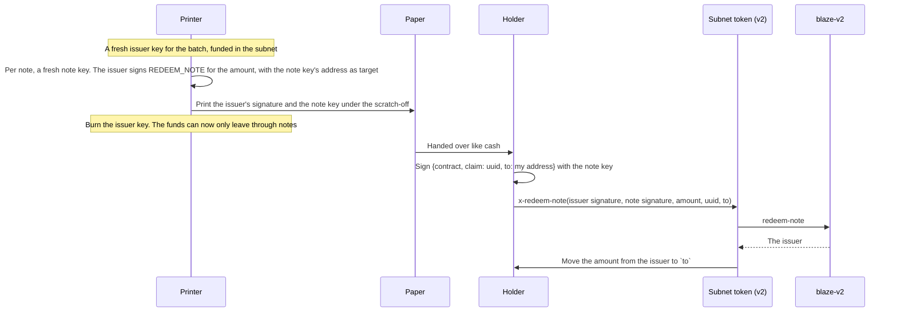
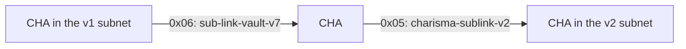

:::info Live since 2026-10-02, alongside v1
Blaze v2 is on mainnet. Every new subnet uses it, and v1 keeps working for every existing balance and signed order.
Sources: [`blaze-v2.clar`](https://github.com/r0zar/charisma/blob/main/packages/clarity/contracts/blaze-v2.clar),
[`x-multihop-v2.clar`](https://github.com/r0zar/charisma/blob/main/packages/clarity/contracts/routers/x-multihop-v2.clar)
and the [design notes](https://github.com/r0zar/charisma/blob/main/packages/clarity/contracts/drafts/BLAZE-V2.md).
:::

| Contract | What it is |
|---|---|
| `SP2ZNGJ85ENDY6QRHQ5P2D4FXKGZWCKTB2T0Z55KS.blaze-v2` | The verifier |
| `SP2ZNGJ85ENDY6QRHQ5P2D4FXKGZWCKTB2T0Z55KS.x-multihop-v2` | The swap router for subnets on either version. It pays only the signer |
| `SP2ZNGJ85ENDY6QRHQ5P2D4FXKGZWCKTB2T0Z55KS.charisma-token-subnet-v2` | CHA on Blaze v2 |
| `SP2ZNGJ85ENDY6QRHQ5P2D4FXKGZWCKTB2T0Z55KS.charisma-sublink-v2` | Moves CHA in and out of the v2 subnet (`0x05` / `0x06`) |

## What changed

| | v1 | v2 |
|---|---|---|
| What you sign | `{contract, intent, opcode, amount, target, uuid}` | The same tuple, under domain version `v2.0` |
| Replay protection | One global set of uuids, written before the signature is checked. Anyone could burn your uuid with a junk signature | Keyed by **signer and uuid**, written after the signature checks out |
| Cancel for good | Spend your uuid through `execute` | `revoke(uuid)`, called directly from your wallet |
| Bearer notes | The note is a signature and the payout address isn't signed, so a mempool watcher can copy it and pay itself | The note holds its own **key**, which signs the payout address. A copy can't be redirected |
| `check` | `check(uuid)` | `check(signer, uuid)` |

For apps, the only signing change is the domain version. `blaze-sdk` picks it from the subnet: `blazeVersionOf(subnet)`
reads which verifier the subnet calls, and every signing and recovery helper follows it.

## Bearer notes: paper cash

Print a note's secret under a scratch-off, hand the paper to anyone, and whoever holds it redeems to any address they
choose.

Change `to`, and the claim recovers a different note address, so the issuer recovers as a stranger with no balance and
nothing moves. The note key never goes on-chain. The burned issuer key is the escrow: once it's gone, the batch's
balance can only leave through notes.

## Moving from v1

Nobody can move your CHA without your signature, so the move can't be automatic. It's built to be effortless instead:

1. **New subnets are v2.** Launchpad generates every subnet against `blaze-v2`.
2. **One balance.** Apps show your v1 and v2 CHA as one number.
3. **Old first, new in.** Spending uses your v1 balance first, and deposits land in v2, so v1 drains through normal use.
4. **One-tap upgrade.** The diagram above is an ordinary swap through `x-multihop-v2`: one free signature, and the solver
   pays the fee.
5. **v1 never switches off.** The contracts can't change, and apps keep supporting v1 balances for as long as they exist.

`x-multihop-v2` accepts a signature that recovers to the payout address under either verifier. The subnet then checks it
again under its own version, so a v2 signature can never move a v1 balance, or the other way round.
