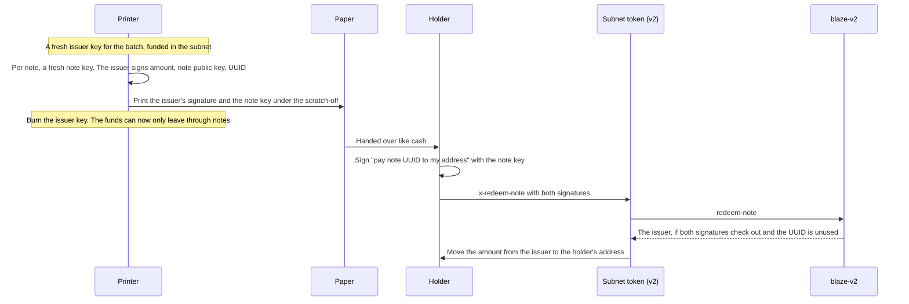

:::info Proposed, not deployed
Blaze v2 is a design saved for later. Its contract compiles and has unit tests, but it isn't on-chain and nothing calls it. Using it means new subnet tokens and moving every subnet balance over to them, which will be announced well ahead. The code: [`blaze-v2.clar`](https://github.com/r0zar/charisma/blob/main/packages/clarity/contracts/drafts/blaze-v2.clar) and its [design notes](https://github.com/r0zar/charisma/blob/main/packages/clarity/contracts/drafts/BLAZE-V2.md).
:::

Blaze v2 keeps everything `blaze-v1` does and fixes the two weak spots in the [trust model](./trust-model.md): bearer redemptions that can be front-run, and UUIDs a stranger can spend.

| | `blaze-v1` (live) | `blaze-v2` (proposed) |
|---|---|---|
| Bearer notes | The note *is* a signature, and the payout address isn't signed. Redeeming publishes the signature, so a mempool watcher can copy it and pay itself first. | The note holds its own **note key**. Redeeming signs "pay **this** address" with it. A copied redemption can't be redirected. |
| Replay protection | One global set of used UUIDs, written before the signature is checked. Anyone can spend someone else's UUID with a junk signature. | Keyed by **signer and UUID**, written after the signature is checked. A junk signature only spends a UUID for a random principal. |
| Domain | `BLAZE_PROTOCOL` / `v1.0` | `BLAZE_PROTOCOL` / `v2.0`, so v1 signatures can't be replayed on v2 |
| Intent hash | `{contract, intent, opcode, amount, target, uuid}` | The same plus `bearer`, a note's public key or `none` |

## Bearer notes: paper cash on Bitcoin

The goal: print a note's secret under a scratch-off, hand the paper to anyone, and whoever holds it redeems to any address they choose.



**Why it can't be front-run.** The contract checks two signatures. The issuer's commits to the note's public key, and the note key's commits to the payout address. Someone who copies the transaction from the mempool can only resend it as it is, which still pays the holder. Changing the address needs the note key, and the note key never goes on-chain.

**What still rests on trust.** Whoever prints a note sees its key, as in v1. The burned issuer key is the escrow: once it's gone, nobody can move the batch's balance except through note redemptions. A vault contract with no withdraw function, only "pay a valid note", would make that burn provable on-chain.

## Replay protection per signer

| A stranger submits your UUID with a junk signature | v1 | v2 |
|---|---|---|
| What gets marked used | Your UUID, for everyone | That UUID for the random principal the junk signature recovers |
| Your signed intent afterwards | Fails, as already used | Still runs |

`check` takes the signer too: `check(signer, uuid)`.

## Messages

All three use the SIP-018 header with the domain `{name: "BLAZE_PROTOCOL", version: "v2.0", chain-id}`.

| Signed by | Tuple | Notes |
|---|---|---|
| The issuer, per note | `{contract, intent: "REDEEM_NOTE", opcode: none, amount: some, target: none, bearer: some <33-byte public key>, uuid}` | `contract` is the subnet that will call `redeem-note` |
| The note key, to redeem | `{contract, claim: uuid, to}` | A different shape from intents, so a claim can't double as an intent |
| Anyone, for a plain intent | `{contract, intent, opcode, amount, target, bearer: none, uuid}` | As in v1 |

A v2 subnet token adds one function next to `x-transfer` and the rest:

```clarity
(define-public (x-redeem-note
    (issuer-signature (buff 65))
    (note-signature   (buff 65))
    (amount           uint)
    (bearer           (buff 33))
    (to               principal)
    (uuid             (string-ascii 36)))
  (let ((issuer (try! (contract-call? .blaze-v2 redeem-note issuer-signature note-signature amount bearer to uuid))))
    (ft-transfer? <subnet-token> amount issuer to)))
```

## Open questions

- **A definitive cancel.** In v1 an owner can spend their own order's UUID on-chain to kill it for good. In v2 a UUID is spent per signer, and only through the subnet the intent names, so that trick stops working. Withdrawing the balance still stops every intent. A `revoke(uuid)` that marks the caller's own UUID used would bring the hard cancel back.

## Before it could ship

- v2 subnet tokens and sublinks that call `blaze-v2`. Balances don't move between versions on their own.
- Routers (`x-multihop-v*`) rebuilt on per-signer replay protection, with a path for open orders.
- Wallet support for signing a claim with a note key. A scanner app could do it straight from a QR code.
- Tools that call `check(uuid)` switched to `check(signer, uuid)`.
- A security audit. Today these are draft semantics with unit tests, not a reviewed protocol.
