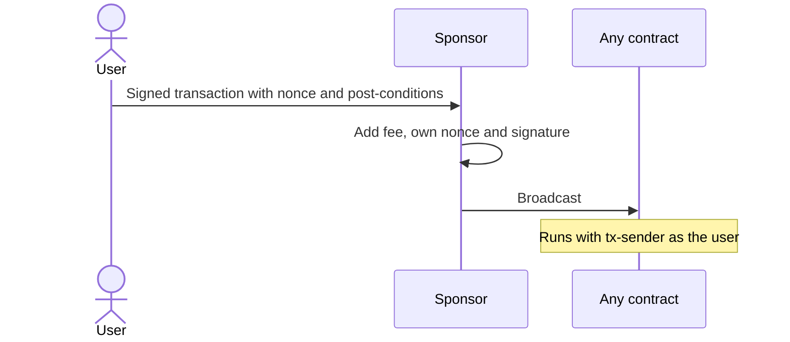
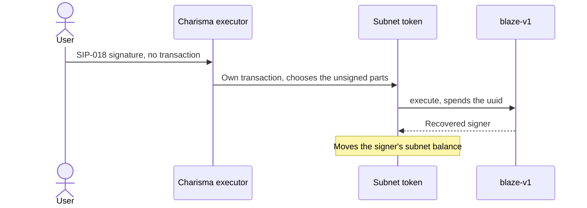

Both let someone else pay the fee. They differ in what the user signs.

| | Sponsored transaction (Stacks native) | Blaze intent (SIP-018) |
|---|---|---|
| What the user signs | A complete Stacks transaction: payload, post-conditions and the user's account nonce, marked as sponsored. The sponsor then adds its own fee, nonce and signature ([SIP-005](https://github.com/stacksgov/sips/blob/main/sips/sip-005/sip-005-blocks-and-transactions.md)). | A structured-data message (`contract`, `intent`, `opcode`, `amount`, `target`, `uuid`), not a transaction. The submitter wraps it in a transaction of its own. |
| `tx-sender` on-chain | The user. `tx-sponsor?` returns the sponsor. | The submitter (Charisma's solver). The contract learns the user from `blaze-v1` `execute` or `recover`. |
| Ordering and replay | Account nonce: one sequence. Any other transaction the user sends with that nonce invalidates it. | UUID: single-use in one global map, order-independent. Many intents can be outstanding and pre-signed for later (triggered orders, DCA as N pre-signed swaps). |
| What can change after signing | Only the sponsor's own fee and nonce. | Everything outside the signed fields. Swaps: the route, vaults and output token always. Recipient on `x-multihop-rc9` and `REDEEM_BEARER`. `x-multihop-v1` binds the payout to the signer. |
| Post-conditions | Part of what the user signs. | Added by the submitter. Charisma's executor attaches deny-mode post-conditions. |
| Which contracts | Any contract call or deploy. | Only contracts that verify through `blaze-v1` (subnet tokens and the routers built on them). Funds must be deposited into the subnet first. |
| Cancelling | Send another transaction with the same nonce first. | A signature can't be revoked. Cancelling an order stops Charisma's executor; withdrawing from the subnet or spending the UUID is the hard stop. |
| Good for | One-off gasless actions the user approves exactly. | Pre-signed, conditional or batched actions run later. |

## Side by side

### Sponsored transaction

### Blaze intent

## When to use which

- The user approves an exact action now but has no STX for fees: use a sponsored transaction.
- The action should run later, on a condition, or many times from one approval: use Blaze, and accept that the submitter chooses the unsigned parts. See the [trust model](./trust-model.md).
