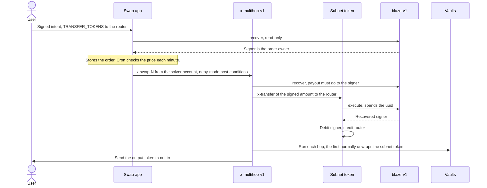

Blaze lets a user sign an action once, off-chain, so someone else can run it on-chain later.

| Piece | What it is |
|---|---|
| Intent | A [SIP-018](https://github.com/stacksgov/sips/blob/main/sips/sip-018/sip-018-signed-structured-data.md) signature over `contract`, `intent`, `opcode`, `amount`, `target`, `uuid`. A message, not a transaction. See [Signing](./signing.md). |
| Verifier | `SP2ZNGJ85ENDY6QRHQ5P2D4FXKGZWCKTB2T0Z55KS.blaze-v1` recovers the signer and marks the UUID used. |
| Funds | Intents spend balances held in [subnet tokens](./subnet-tokens.md), not wallet balances. Deposit first. |
| Swaps | A `TRANSFER_TOKENS` intent whose target is a [swap router](./routers.md) becomes a multi-hop swap. |

## Who executes today

There is one executor: Charisma's swap app. A cron job runs every minute, checks each open order's price condition off-chain, and broadcasts the swap from Charisma's solver account `SP3619DGWH08262BJAG0NPFHZQDPN4TKMXHC0ZQDN`, which pays the fee. Orders without a condition run when their owner calls the execute endpoint. On-chain, anyone holding a signature can submit it. The [trust model](./trust-model.md) covers what that means.

Placing, listing and cancelling orders over HTTP is documented in the DEX API, starting with [POST /orders/new](../dex-api/orders-new.md). For how Blaze differs from Stacks' own fee sponsorship, see [Blaze vs sponsored transactions](./blaze-vs-sponsored.md).

## A triggered swap, end to end

