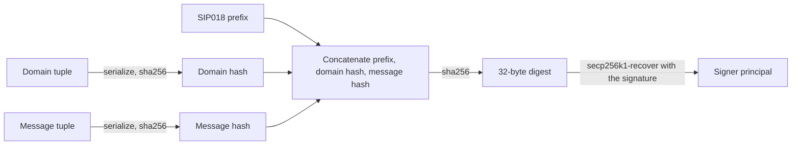

An intent is a SIP-018 signature over a six-field tuple; `blaze-v1` recovers who signed it.

## Domain and message

```clarity
;; domain (chain-id u1 is mainnet)
{name: "BLAZE_PROTOCOL", version: "v1.0", chain-id: u1}

;; message
{
  contract: principal,            ;; the subnet that will call blaze-v1
  intent:   (string-ascii 32),    ;; e.g. "TRANSFER_TOKENS"
  opcode:   (optional (buff 16)), ;; none for every current intent
  amount:   (optional uint),
  target:   (optional principal),
  uuid:     (string-ascii 36)
}
```

## Hashing

From `blaze-v1`:

```clarity
(define-constant structured-data-prefix 0x534950303138) ;; "SIP018"
(define-constant message-domain {name: "BLAZE_PROTOCOL", version: "v1.0", chain-id: chain-id})
(define-constant message-domain-hash (sha256 (unwrap-panic (to-consensus-buff? message-domain))))
(define-constant structured-data-header (concat structured-data-prefix message-domain-hash))

(define-read-only (hash (contract principal) (intent (string-ascii 32)) (opcode (optional (buff 16)))
                        (amount (optional uint)) (target (optional principal)) (uuid (string-ascii 36)))
  (ok (sha256 (concat structured-data-header (sha256
    (unwrap! (to-consensus-buff? {contract: contract, intent: intent, opcode: opcode,
                                  amount: amount, target: target, uuid: uuid}) ERR_CONSENSUS_BUFF))))))
```



This is standard SIP-018, so `signStructuredData` from `@stacks/transactions` and the wallet method `stx_signStructuredMessage` produce signatures `blaze-v1` accepts.

## Intents

| `intent` | Subnet function | `amount` | `target` | Submitter chooses |
|---|---|---|---|---|
| `TRANSFER_TOKENS` | `x-transfer` | Amount | Recipient | Nothing |
| `TRANSFER_TOKENS_LTE` | `x-transfer-lte` | Upper bound | Recipient | `actual`, up to the bound |
| `REDEEM_BEARER` | `x-redeem` | Amount | `none` | Recipient |

A swap is `TRANSFER_TOKENS` with the router as `target`. See [Swap routers](./routers.md).

## The opcode field

`opcode` is an optional buffer of up to 16 bytes, signed with the rest of the intent. Every intent today sets it to `none`.

It is a free, signed variable. When `intent`, `amount` and `target` don't pin down enough, a contract can require an opcode and enforce what it says. The signer then commits to more than the intent alone, and new behaviour needs no new intent type and no new verifier:

1. The signer puts the extra terms in `opcode` and signs.
2. The submitter passes the opcode to the contract, which hands it to `blaze-v1` `execute` or `recover`. If it isn't what was signed, a different principal is recovered and the call fails.
3. The contract enforces the terms.

Ideas, none of them built:

| A signed opcode could carry | Enforced by |
|---|---|
| A minimum output. 16 bytes is one `uint`, read with `buff-to-uint-be` | The router, after the last hop. Today there is [no minimum on-chain](./routers.md#no-minimum-output-on-chain) |
| A deadline block height | The subnet or router, against `stacks-block-height` |
| A route or vault, as 16 bytes of its hash | The router, before the first hop |
| A [Dexterity operation](../dexterity/opcodes.md) | A vault that runs signed operations |

Where it stands:

| Place | `opcode` |
|---|---|
| Live subnets: `x-transfer`, `x-transfer-lte`, `x-redeem` | `none`, hard-coded in the call to `blaze-v1` |
| `x-multihop-v1` signer check | `none`, hard-coded |
| `signTriggeredSwap` | `none` |
| `signIntentWithWallet`, `signIntentWithPrivateKey`, `recoverSigner`, `generateHash` | Accept `opcode` as a hex string |

Because the live contracts hard-code `none`, a signature over any other opcode recovers a different principal on them and fails. Only a contract written to pass an opcode can use one.

:::note Not the Dexterity opcode
Dexterity vaults take an `opcode` of the same type, but it selects which operation a vault runs, and whoever builds the transaction chooses it. A Blaze opcode is signed and makes an intent stricter. See [The opcode](../dexterity/opcodes.md).
:::

## blaze-sdk helpers

These live in the monorepo package `packages/blaze-sdk`. The `blaze-sdk` on npm is an older release without them.

| Helper | Does |
|---|---|
| `signTriggeredSwap({ subnet, uuid, amount, multihopContractId? })` | Wallet signs one swap intent with `stx_signStructuredMessage`. The router defaults to `MULTIHOP_CONTRACT_ID` (`x-multihop-v1`). Returns the 65-byte signature as hex. |
| `signTriggeredSwaps(inputs)` | Many swap intents from one approval through Blaze Wallet's `blaze_signStructuredMessages`. Check `canSignInBulk()` first. |
| `signIntentWithWallet` / `signIntentWithPrivateKey` | Any intent tuple. |
| `recoverSigner(signature, contract, intent, uuid, { amount, target })` | Calls `blaze-v1` `recover`. |
| `checkUUID(uuid)` | Calls `blaze-v1` `check`. |

```ts
import { signTriggeredSwap } from 'blaze-sdk';

const signature = await signTriggeredSwap({
  subnet: 'SP2ZNGJ85ENDY6QRHQ5P2D4FXKGZWCKTB2T0Z55KS.sbtc-token-subnet-v1',
  uuid: crypto.randomUUID(),
  amount: 10_000n, // micro units
});
```

## blaze-v1 functions

| Function | Kind | Does |
|---|---|---|
| `execute (signature, intent, opcode, amount, target, uuid)` | Public | Records the UUID (`u409000` if already used), hashes with `contract-caller` as `contract`, returns `(ok signer)`. |
| `recover (signature, contract, intent, opcode, amount, target, uuid)` | Read-only | Same recovery for any `contract`. Writes nothing. |
| `check (uuid)` | Read-only | `true` if the UUID is used. |
| `hash`, `verify` | Read-only | The digest above, and signature-to-principal recovery. |

## A wrong signature recovers someone else

`blaze-v1` doesn't error on a wrong signature and never compares the signer with anything. A well-formed signature over different fields (another amount, target, UUID, subnet or domain) recovers some unrelated principal and returns `ok`. The subnet then debits that principal, which normally has nothing, so the call fails with `u400` (on `x-multihop-v1` the payout check fails first with `u403`). Only a signature from which no key can be recovered returns `u401000`. To check a signature before submitting it, call `recover` and compare the result with the expected owner. `/orders/new` does this.

## UUIDs

- Any ASCII string up to 36 characters. v4 UUIDs are a convention, not a rule.
- `submitted-uuids` is one map keyed by UUID alone, shared by every subnet, router and signer. Use a fresh UUID for every intent.
- `execute` records the UUID before recovering the signer and never looks at balances. Anyone can call `execute` directly with your UUID and a signature of their own, and your intent can then never run.
- If the subnet fails after `execute` (for example, insufficient balance), the whole transaction aborts and the UUID insert is rolled back with it.
