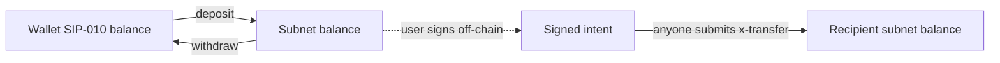

A subnet token holds a SIP-010 token 1:1 and keeps its own balance ledger that signed intents can spend.

## Live contracts

| Subnet | Underlying token |
|---|---|
| `SP2ZNGJ85ENDY6QRHQ5P2D4FXKGZWCKTB2T0Z55KS.charisma-token-subnet-v1` | `SP2ZNGJ85ENDY6QRHQ5P2D4FXKGZWCKTB2T0Z55KS.charisma-token` |
| `SP2ZNGJ85ENDY6QRHQ5P2D4FXKGZWCKTB2T0Z55KS.sbtc-token-subnet-v1` | `SM3VDXK3WZZSA84XXFKAFAF15NNZX32CTSG82JFQ4.sbtc-token` |
| `SP2ZNGJ85ENDY6QRHQ5P2D4FXKGZWCKTB2T0Z55KS.welsh-token-subnet-v1` | `SP3NE50GEXFG9SZGTT51P40X2CKYSZ5CC4ZTZ7A2G.welshcorgicoin-token` |
| `SP2ZNGJ85ENDY6QRHQ5P2D4FXKGZWCKTB2T0Z55KS.pepe-token-subnet-v1` | `SP1Z92MPDQEWZXW36VX71Q25HKF5K2EPCJ304F275.tokensoft-token-v4k68639zxz` |

These four are the same code with a different underlying token. There is no sUSDC subnet: `susdc-token-subnet-v1` is not deployed. Charisma's token list (`https://tokens.charisma.rocks/api/v1/sip10`) marks every subnet it knows with `type: "SUBNET"`.

## Functions

| Function | Caller | Effect |
|---|---|---|
| `deposit (amount, recipient?)` | Holder | Pulls the underlying token in and credits `recipient` (default: `tx-sender`). |
| `withdraw (amount, recipient?)` | Holder | Debits `tx-sender` and sends the underlying token to `recipient`. |
| `transfer (amount, from, to, memo)` | `from` | Ledger move. `from` must be `tx-sender`. |
| `x-transfer (signature, amount, uuid, to)` | Anyone | `TRANSFER_TOKENS`: moves `amount` from the signer to `to`. |
| `x-transfer-lte (signature, bound, actual, uuid, to)` | Anyone | `TRANSFER_TOKENS_LTE`: moves `actual`, at most `bound`, from the signer to `to`. |
| `x-redeem (signature, amount, uuid, to)` | Anyone | `REDEEM_BEARER`: moves `amount` from the signer to any `to` the caller picks. |
| `get-balance (owner)` | Read-only | `(ok uint)`, the subnet balance. |

`get-name`, `get-symbol`, `get-decimals`, `get-token-uri` and `get-total-supply` pass through to the underlying token, so `get-total-supply` is the underlying token's supply, not the amount deposited.

The signed functions look like this in `charisma-token-subnet-v1`:

```clarity
(define-public (x-transfer
    (signature (buff 65))
    (amount uint)
    (uuid   (string-ascii 36))
    (to     principal))
  (let ((signer (try! (contract-call? 'SP2ZNGJ85ENDY6QRHQ5P2D4FXKGZWCKTB2T0Z55KS.blaze-v1 execute signature "TRANSFER_TOKENS" none (some amount) (some to) uuid))))
    (try! (internal-transfer signer to amount))
    (print {event: "x-transfer", from: signer, to: to, amount: amount, uuid: uuid})
    (ok true)))
```

`blaze-v1` uses the calling contract as the signed `contract`, so a signature only works on the subnet it names. Errors: `u400` insufficient balance, `u401` `transfer` not sent by `from`, `u402` `actual` above `bound`.

## Life of a balance



## Reading balances

Read `get-balance` on-chain:

```ts
import { fetchCallReadOnlyFunction, Cl, cvToValue } from '@stacks/transactions';

const res = await fetchCallReadOnlyFunction({
  contractAddress: 'SP2ZNGJ85ENDY6QRHQ5P2D4FXKGZWCKTB2T0Z55KS',
  contractName: 'sbtc-token-subnet-v1',
  functionName: 'get-balance',
  functionArgs: [Cl.principal(owner)],
  senderAddress: owner,
  network: 'mainnet',
});
const balance = BigInt(cvToValue(res).value); // (ok uint), micro units
```

:::note
`getUserTokenBalance(contractId, address)` in `blaze-sdk` makes the same on-chain `get-balance` call. It returns `onChainBalance` as a string (`pendingDiff` is always `"0"`) and throws a descriptive error if the chain can't be read. It lives in the monorepo package `packages/blaze-sdk`; the npm 1.0.10 release is older.
:::

## Deploy your own

The [Launchpad subnet-wrapper template](https://launchpad.charisma.rocks/templates/subnet-wrapper) generates this contract for any SIP-010 token, wired to `blaze-v1`. `x-redeem` is on by default and `x-transfer-lte` off. The generated code is Clarity 4 (`withdraw` uses `as-contract?` with an FT allowance) and its error codes are `u4000`, `u4010`, `u4020`. Swaps from a subnet start with a sublink vault that unwraps it; Launchpad has a [sublink template](https://launchpad.charisma.rocks/templates/sublink) too.

## No admin

Neither the subnet contracts nor `blaze-v1` has an owner, admin, pause or upgrade function, or any data variable. Their only state is the `balances` map and the `submitted-uuids` map. A balance moves only when its holder calls `transfer` or `withdraw`, or when someone submits a signature that recovers to that holder.
