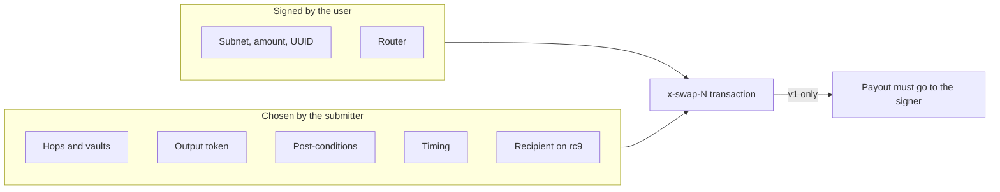

A Blaze signature authorizes one movement out of a subnet balance; whoever submits it chooses everything it doesn't sign.

## Signed vs chosen

| | `TRANSFER_TOKENS` | `REDEEM_BEARER` | Swap on `x-multihop-v1` | Swap on `x-multihop-rc9` |
|---|---|---|---|---|
| Subnet, amount, UUID | Signed | Signed | Signed | Signed |
| Recipient | Signed | Submitter | Forced to the signer | Submitter |
| Router | | | Signed | Signed |
| Hops, vaults, output token | | | Submitter | Submitter |
| Minimum output | | | Submitter's post-conditions | Submitter's post-conditions |
| When it runs | Submitter | Submitter | Submitter | Submitter |

## What follows

- **A signature is bearer authority for its unsigned parts.** Whoever holds a v1 swap signature can't redirect the payout, but can route the input through any contract that implements the vault trait, including one that keeps it. An rc9 or `REDEEM_BEARER` signature lets the holder pay themselves.
- **Signatures never leave the server.** The public order endpoints (`/api/v1/orders/...`) return orders without the `signature` field.
- **There is no vault allowlist on-chain.** Charisma's executor only routes through vaults in its dex-cache vault registry and attaches deny-mode post-conditions. Those protections come from Charisma being the submitter, not from the contracts.
- **Conditions are off-chain.** Price triggers, `validFrom` / `validTo` and the 90-day maximum age are checked by the executor.

## Cancelling

Cancelling an order (`PATCH /api/v1/orders/{uuid}/cancel`) only stops Charisma's executor. The signature stays valid. The hard stops are on-chain:

| Action | Effect |
|---|---|
| `withdraw` the subnet balance | The intent fails for insufficient balance. |
| Call `blaze-v1` `execute` with the order's UUID and any valid signature (the order's own works) | The UUID is spent; `check` returns `true`. |

## Mempool exposure

Broadcasting a transaction publishes its signature. Until it confirms, anyone watching the mempool can copy the signature into a competing transaction with a higher fee:

| Intent | What a copier controls |
|---|---|
| `REDEEM_BEARER` (`to` isn't signed) | The recipient |
| Swap on rc9 (`out.to` isn't bound) | The recipient |
| Swap on v1 | The route and output token, not the recipient |
| `TRANSFER_TOKENS` | Only who pays the fee |

So bearer-style redemptions can be front-run. UUIDs are public too (order APIs return them), so anyone can spend an open order's UUID through `execute` and stop it. That is griefing, not theft.
