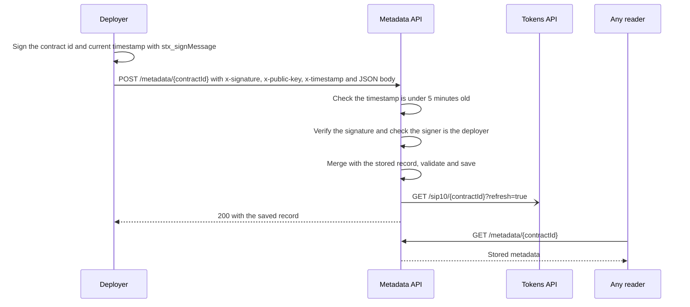

# Metadata API

Hosts SIP-16 token metadata JSON, the file a token's `token_uri` points to. A token's deployer can publish or update its own record by signing the contract id.

**Base URL:** `https://metadata.charisma.rocks/api/v1`

CORS is limited to Charisma sites. From anywhere else, call the API from a server or script.

## GET /metadata/`{contractId}`

The stored metadata for one contract.

| Param | In | Notes |
|---|---|---|
| `contractId` | path | `address.contract-name` |

```bash
curl https://metadata.charisma.rocks/api/v1/metadata/SP2ZNGJ85ENDY6QRHQ5P2D4FXKGZWCKTB2T0Z55KS.charisma-token
```

```json
{
  "name": "Charisma",
  "description": "The primary token of the Charisma ecosystem.",
  "image": "https://charisma.rocks/charisma-logo-square.png",
  "lastUpdated": "1750828941427",
  "decimals": 6,
  "symbol": "CHA"
}
```

Older records keep `symbol` and `decimals` at the top level; newer ones put them in `properties`, sometimes in both places. `lastUpdated` is a string: Unix ms in older records, ISO 8601 in newer ones.

**Errors:** `404` `{ "error": "Metadata not found" }` · `500` `{ "success": false, "error": "Failed to fetch token metadata" }`

**Caching:** `Cache-Control: public, s-maxage=3600, stale-while-revalidate=86400`. Records with `lastUpdated` return an `ETag`; send it back as `If-None-Match` to get `304 Not Modified`.

## GET /metadata/list

All stored records, each with its `contractId`.

| Param | In | Notes |
|---|---|---|
| `principal` | query | Optional. Keep records whose contract id starts with this, e.g. a deployer address. |

The full list is several MB, so filter by `principal` when you can.

```bash
curl "https://metadata.charisma.rocks/api/v1/metadata/list?principal=SP2ZNGJ85ENDY6QRHQ5P2D4FXKGZWCKTB2T0Z55KS"
```

```json
{
  "success": true,
  "metadata": [
    {
      "name": "ALEX aBTC-sUSDT",
      "description": "Liquidity vault wrapper for the aBTC-sUSDT trading pair (ALEX AMM pool 104)",
      "image": "https://token-images.alexlab.co/token-abtc",
      "symbol": "ABTCSUSDT",
      "decimals": 8,
      "identifier": "ABTCSUSDT",
      "properties": {
        "tokenAContract": "SP2XD7417HGPRTREMKF748VNEQPDRR0RMANB7X1NK.token-abtc",
        "tokenBContract": "SP2XD7417HGPRTREMKF748VNEQPDRR0RMANB7X1NK.token-susdt",
        "externalPoolId": "SP102V8P0F7JX67ARQ77WEA3D3CFB5XW39REDT0AM.amm-vault-v2-01",
        "swapFeePercent": 0.5,
        "…": "…"
      },
      "contractId": "SP2ZNGJ85ENDY6QRHQ5P2D4FXKGZWCKTB2T0Z55KS.alex-abtc-susdt",
      "lastUpdated": "2026-10-01T01:48:40.115Z"
    }
  ]
}
```

**Errors:** `500` `{ "success": false, "error": "Failed to list tokens" }`

**Caching:** `Cache-Control: public, s-maxage=300, stale-while-revalidate=900`.

## POST /metadata/`{contractId}`

Create or update a token's metadata, signed by its deployer.

:::note
This section is written from the source code. It was not exercised against production.
:::

### How auth works

1. The deployer signs the JSON string `{"message":"<contractId>","timestamp":<ms>}` with `stx_signMessage`, using the current time in Unix ms.
2. The request sends `x-signature`, `x-public-key` and `x-timestamp` (the same ms value).
3. The server rejects a timestamp more than 5 minutes old, rebuilds the signed string from the contract id and `x-timestamp`, checks the signature, and derives the signer's mainnet address from the public key.
4. That address must equal the part of the contract id before the dot, which is the deployer.



Things to know:

- A signature is accepted for 5 minutes. It covers the contract id and timestamp, not the body.
- The signer address comes from a single public key, so contracts deployed from a multisig address can't use this.
- After a save, the Metadata API asks the Tokens API to re-read the token, without waiting for the result. Edge-cached Tokens API responses can still lag by their cache time.

### Body

The body is merged onto the stored record, so fields you leave out are kept. Unknown fields are kept too.

| Field | Type | Notes |
|---|---|---|
| `name` | string | Required, unless already stored |
| `description` | string | |
| `image` | string | Image URL |
| `sip` | number | Usually `16` |
| `attributes` | array | `{ trait_type, value, display_type? }` |
| `properties` | object | `symbol`, `decimals`, `identifier`, `tokenAContract`, `tokenBContract`, `lpRebatePercent`, `swapFeePercent`, `externalPoolId`, `engineContractId`, plus any extra keys |
| `localization` | object | `{ uri, default, locales }`; `uri` is required if present |
| `external_url`, `animation_url`, `image_data` | string | |

### Example

```ts
import { request } from '@stacks/connect';

const contractId = 'SP….my-token'; // your deployer address + contract name
const timestamp = Date.now();

// 1. In the browser: the deployer's wallet signs {"message":"<contractId>","timestamp":<ms>}
const { signature, publicKey } = await request('stx_signMessage', {
  message: JSON.stringify({ message: contractId, timestamp }),
});

// 2. Within 5 minutes, from your server or script (CORS blocks non-Charisma origins)
const res = await fetch(`https://metadata.charisma.rocks/api/v1/metadata/${contractId}`, {
  method: 'POST',
  headers: {
    'Content-Type': 'application/json',
    'x-signature': signature,
    'x-public-key': publicKey,
    'x-timestamp': String(timestamp),
  },
  body: JSON.stringify({
    name: 'My Token',
    description: 'What the token is for.',
    image: 'https://example.com/my-token.png',
    properties: { symbol: 'MYT', decimals: 6 },
  }),
});
```

Inside the Charisma monorepo, `blaze-sdk`'s `signedFetchWithTimestamp(url, { message: contractId, method, body })` does both steps.

Success returns `{ "success": true, "contractId": "…", "metadata": { …saved record } }`.

**Errors**

| Status | Body | Cause |
|---|---|---|
| `400` | `{ "error": "Invalid contract ID format" }` | Contract id isn't `S….name` |
| `401` | `{ "error": "Missing authentication headers" }` | No `x-signature` or `x-public-key` |
| `401` | `{ "error": "Missing timestamp header" }` | No `x-timestamp` |
| `401` | `{ "error": "Invalid timestamp format" }` | `x-timestamp` isn't a number |
| `401` | `{ "error": "Message expired" }` | Timestamp more than 5 minutes old |
| `401` | `{ "error": "Invalid signature" }` | Signature doesn't match the contract id and timestamp |
| `401` | `{ "error": "Not authorised" }` | Signer isn't the deployer |
| `500` | `{ "error": "Validation error: …" }` | Body fails validation |
| `500` | `{ "error": "Failed to save metadata: …" }` | Storage failure |

Responses send `Cache-Control: no-cache, no-store, must-revalidate`.
