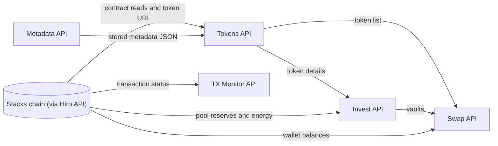

# Data APIs

Public, read-only HTTP APIs for Charisma's token, vault, metadata, balance and transaction data.

| API | Base URL | Serves | Browser CORS |
|---|---|---|---|
| [Tokens](./tokens-api.md) | `https://tokens.charisma.rocks/api/v1` | Details for every tracked token, plus the block list | Any origin |
| [Invest](./invest-api.md) | `https://invest.charisma.rocks/api/v1` | Vaults, routable tokens, energy | Any origin, except the two energy JSON reads |
| [Metadata](./metadata-api.md) | `https://metadata.charisma.rocks/api/v1` | Token metadata JSON; deployer-signed updates | Charisma sites only |
| [Swap](./swap-data.md) | `https://swap.charisma.rocks/api/v1` | Wallet balances, subnet pairings, platform stats | `/stats` only |
| [TX Monitor](./tx-monitor-api.md) | `https://tx.charisma.rocks/api/v1` | Transaction status | Charisma sites only |

Prices are served by the Invest API and documented in the [Pricing API reference](../prices/api-reference.md). Quotes and orders are in the [DEX API](../dex-api/quote.md) docs.

## Authentication

Every `GET` in this section is public: no key, no signature. The only write covered here is the Metadata API's `POST`, which the token's deployer signs.

Where CORS isn't open, call the API from your server instead of the browser.

## How the data flows

## Conventions

- Amounts (reserves, balances, supply) are raw integers in the token's smallest unit. Divide by `10^decimals`.
- Contract ids are `address.contract-name`. Native STX is `.stx`.
- Timestamps are Unix milliseconds unless a page says otherwise.
- Responses are cached. Each endpoint lists its `Cache-Control`, so data can be a few minutes old.
