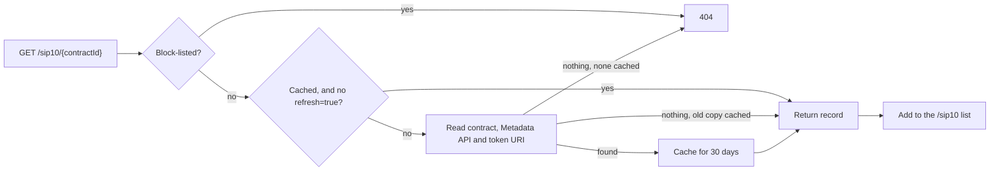

# Tokens API

Cached details for every token Charisma tracks: name, symbol, decimals, image and type.

**Base URL:** `https://tokens.charisma.rocks/api/v1` · CORS open to any origin.

## Token record

| Field | Type | Notes |
|---|---|---|
| `contractId` | string | `address.contract-name` |
| `name`, `symbol` | string | |
| `decimals` | number | Divide raw amounts by `10^decimals` |
| `identifier` | string | Fungible-token name inside the contract. For `SUBNET` tokens, the base token's. |
| `image` | string | Logo URL. Can be a `data:` URI or a generated placeholder. |
| `description` | string | |
| `total_supply` | number | Raw units, when known |
| `token_uri` | string | On-chain metadata URI, when set |
| `type` | string | Absent for plain SIP-10 tokens. See below. |
| `base` | string | `SUBNET`: the mainnet token it holds |
| `tokenAContract`, `tokenBContract` | string | `POOL`, `SUBLINK`: the two sides |
| `lpRebatePercent` | number | `POOL`: swap fee, in percent, paid to liquidity providers |
| `lastUpdated` | number | Last refresh, Unix ms |

| `type` | Meaning |
|---|---|
| *(absent)* | Plain SIP-10 token |
| `SUBNET` | Blaze subnet token that holds `base` 1:1 |
| `POOL` | Liquidity pool (LP) token |
| `SUBLINK` | Vault that moves `tokenAContract` to its subnet token `tokenBContract` |

Records can carry other fields copied from upstream sources (`contract_principal`, `asset_identifier`, `external`, …). Don't rely on them.

## GET /sip10

Every tracked token, minus block-listed ones and records missing `contractId`, `symbol` or `decimals`. About 1,000 records (~430 KB); use [`/sip10-paginated`](#get-sip10-paginated) for search UIs.

```bash
curl https://tokens.charisma.rocks/api/v1/sip10
```

```json
[
  {
    "name": "sBTC",
    "symbol": "sBTC",
    "decimals": 8,
    "identifier": "sbtc-token",
    "contractId": "SP2ZNGJ85ENDY6QRHQ5P2D4FXKGZWCKTB2T0Z55KS.sbtc-token-subnet-v1",
    "type": "SUBNET",
    "base": "SM3VDXK3WZZSA84XXFKAFAF15NNZX32CTSG82JFQ4.sbtc-token",
    "image": "https://assets.hiro.so/api/mainnet/token-metadata-api/SM3VDXK3WZZSA84XXFKAFAF15NNZX32CTSG82JFQ4.sbtc-token/1.png",
    "total_supply": 248146656582,
    "lastUpdated": 1750963997294
  }
]
```

**Errors:** `500` `{ "error": "Failed to fetch tokens" }`

**Caching:** `Cache-Control: public, max-age=600`; edge cache 6 h (stale-while-revalidate 1 d).

## GET /sip10/`{contractId}`

One token.

| Param | In | Notes |
|---|---|---|
| `contractId` | path | `address.contract-name` |
| `refresh` | query | `true` skips the cache: re-reads the chain and the Metadata API, then re-caches |

```bash
curl https://tokens.charisma.rocks/api/v1/sip10/SM3VDXK3WZZSA84XXFKAFAF15NNZX32CTSG82JFQ4.sbtc-token
```

```json
{
  "status": "success",
  "data": {
    "name": "sBTC",
    "symbol": "sBTC",
    "decimals": 8,
    "identifier": "sbtc-token",
    "contractId": "SM3VDXK3WZZSA84XXFKAFAF15NNZX32CTSG82JFQ4.sbtc-token",
    "total_supply": 248146656582,
    "lastUpdated": 1750963921513,
    "image": "https://assets.hiro.so/api/mainnet/token-metadata-api/SM3VDXK3WZZSA84XXFKAFAF15NNZX32CTSG82JFQ4.sbtc-token/1.png"
  }
}
```

A token the cache hasn't seen is read from the chain on first request and tracked from then on:



**Errors**

| Status | Body |
|---|---|
| `400` | `{ "error": "Invalid contract ID format, expected format: [address].[contract-name]", "status": "error" }` |
| `404` | `{ "error": "Token not found", "status": "error" }` (unknown or block-listed) |
| `429` | Upstream rate limit; `Retry-After: 60` |
| `500` | `{ "error": "Internal Server Error", "status": "error" }` |

**Caching:** `Cache-Control: public, max-age=3600`; edge cache 24 h (stale-while-revalidate 7 d).

## GET /sip10-paginated

The `/sip10` list, paged and searchable.

| Param | In | Default | Notes |
|---|---|---|---|
| `page` | query | `1` | 1-based |
| `limit` | query | `20` | Max `100` |
| `search` | query | | Case-insensitive match on name, symbol or contract id |

```bash
curl "https://tokens.charisma.rocks/api/v1/sip10-paginated?search=welsh&limit=2"
```

```json
{
  "tokens": [
    { "contractId": "SP2ZNGJ85ENDY6QRHQ5P2D4FXKGZWCKTB2T0Z55KS.liquid-staked-welsh-v2", "symbol": "sWELSH", "decimals": 6, "…": "…" },
    { "contractId": "SP2ZNGJ85ENDY6QRHQ5P2D4FXKGZWCKTB2T0Z55KS.synthetic-welsh", "symbol": "iouWELSH", "decimals": 6, "…": "…" }
  ],
  "pagination": { "page": 1, "limit": 2, "total": 43, "totalPages": 22, "hasMore": true, "hasPrevious": false },
  "search": "welsh"
}
```

**Errors:** `500` `{ "error": "Failed to fetch tokens", "details": "…" }`

**Caching:** `Cache-Control: public, max-age=300`; edge cache 1 h (stale-while-revalidate 1 d).

## GET /metadata

The same records as `/sip10`, without dropping incomplete ones.

**Errors:** `500` `{ "error": "Failed to fetch metadata" }`

**Caching:** `Cache-Control: public, max-age=900`; edge cache 6 h (stale-while-revalidate 2 d).

## GET /blacklist

Contract ids hidden from every other endpoint (scams, spam). Changing the list needs an admin key.

```json
{
  "success": true,
  "data": [
    "SP1PMSY2QNBEH38BYJJ75EHQX3CMR70MCT51D4G30.BabyMojo",
    "SP2ZNGJ85ENDY6QRHQ5P2D4FXKGZWCKTB2T0Z55KS.liquid-staked-charisma",
    "SP37WN2BYHKZ90T1ATHTCNG8EFYHS3B49KNGS02ZK.RALEX"
  ],
  "count": 3
}
```

**Errors:** `500` `{ "success": false, "error": "Failed to fetch blacklisted tokens", "data": [] }`

**Caching:** `Cache-Control: no-cache, no-store, must-revalidate`.
