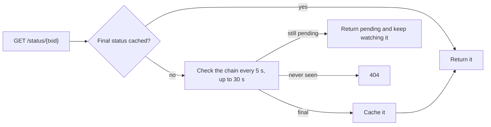

# TX Monitor API

The status of any Stacks transaction, cached once it's final.

**Base URL:** `https://tx.charisma.rocks/api/v1`

CORS is limited to Charisma sites. From anywhere else, call it from a server.

## GET /status/`{txid}`

| Param | In | Notes |
|---|---|---|
| `txid` | path | `0x` + 64 hex characters, or 64 hex characters without `0x` |

```bash
curl https://tx.charisma.rocks/api/v1/status/0xa039c44666041b433f7c3ea82e0635988665e2affd1fea6ed2d9a06f96b939ee
```

```json
{
  "success": true,
  "data": {
    "txid": "0xa039c44666041b433f7c3ea82e0635988665e2affd1fea6ed2d9a06f96b939ee",
    "status": "success",
    "blockHeight": 99953,
    "blockTime": 1679877507,
    "fromCache": false,
    "checkedAt": 1790907417526
  }
}
```

| Field | Notes |
|---|---|
| `status` | `success`, `abort_by_response`, `abort_by_post_condition` or `pending` |
| `blockHeight` | Set once confirmed |
| `blockTime` | Unix **seconds** |
| `fromCache` | `true` when served from the cache of final statuses |
| `checkedAt` | Unix ms |

A transaction that isn't final yet holds the request open for up to about 30 seconds:



**Errors**

| Status | Body | Cause |
|---|---|---|
| `404` | `{ "success": false, "error": "Transaction not found", "message": "Invalid transaction ID format" }` | Malformed id |
| `404` | `{ "success": false, "error": "Transaction not found", "message": "Transaction ID not found on blockchain" }` | Not on chain after about 30 s |
| `500` | `{ "success": false, "error": "Failed to check transaction status", "message": "…" }` | Upstream failure |

**Caching:** final statuses send `Cache-Control: public, max-age=3600, stale-while-revalidate=86400` and a stable `ETag` of `"<txid>-<status>"`; send it back as `If-None-Match` to get `304 Not Modified`. `pending` sends `public, max-age=30, stale-while-revalidate=300, must-revalidate` and no `ETag`.
