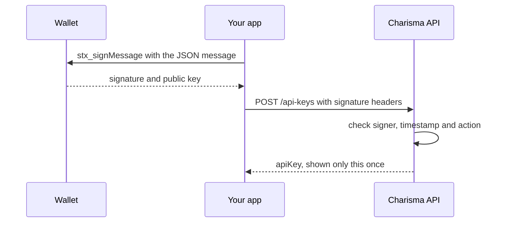

# API keys

An API key lets a bot cancel or execute its owner's orders without asking the wallet to sign each request.

The easiest way to create and revoke keys is the [API keys page](https://swap.charisma.rocks/api-keys) in the app. The endpoints below do the same thing.

| Permission | Allows |
| --- | --- |
| `execute` | `POST /orders/{uuid}/execute` |
| `cancel` | `PATCH /orders/{uuid}/cancel` |
| `create` | Nothing at the moment. `POST /orders/new` relies on the order signature and ignores API keys. |

- **Scope.** A key works only on orders whose `owner` is the wallet that created the key.
- **Format.** Keys look like `ck_live_` followed by 64 hex characters. The full key is shown once, at creation. Charisma stores only a hash of it.
- **Rate limit.** Each key gets 100 requests per minute, counted in fixed one-minute windows. Past the limit, requests return `429 RATE_LIMIT_EXCEEDED` with the `X-RateLimit-Limit`, `X-RateLimit-Remaining`, `X-RateLimit-Reset` (Unix seconds) and `X-RateLimit-Window` headers.
- **Expiry.** `expiresAt` is optional. Once it passes, the key stops working and is marked revoked.

## Signing management requests

The wallet signs every management call. Build a JSON message with an `action` and a `timestamp` in milliseconds, which must be within 5 minutes of the server's clock. Sign that exact string with `stx_signMessage`, then send:

| | `POST /api-keys`, `DELETE /api-keys/{keyId}` | `GET /api-keys`, `GET /api-keys/{keyId}` |
| --- | --- | --- |
| Signature | `x-signature` and `x-public-key` headers | `x-signature` and `x-public-key` headers |
| Signed message | `message` in the body | `x-message` header |
| Wallet address (mainnet `SP…`) | `walletAddress` in the body | `x-wallet-address` header |



```ts
import { request } from '@stacks/connect';

const message = JSON.stringify({
  action: 'create_api_key',
  keyName: 'my-bot',
  permissions: ['execute', 'cancel'],
  timestamp: Date.now(),
});
const { signature, publicKey } = await request('stx_signMessage', { message });

// No CORS on this API: pass message, signature and publicKey to your server and send this from there
const res = await fetch('https://swap.charisma.rocks/api/v1/api-keys', {
  method: 'POST',
  headers: { 'Content-Type': 'application/json', 'x-signature': signature, 'x-public-key': publicKey },
  body: JSON.stringify({ message, walletAddress: 'SP_OWNER_ADDRESS' }),
});
const { apiKey, keyId } = await res.json(); // Store apiKey now. It is never shown again.
```

## Endpoints

| Call | Signed message | Response |
| --- | --- | --- |
| `POST /api-keys` | `action: "create_api_key"`, `keyName` (1–100 letters, digits, spaces, `-` or `_`, unique among your active keys), `permissions` (1–3 of the above), optional `expiresAt` (a future ISO date) | `{ status, apiKey, keyId, name, permissions, rateLimit, expiresAt }` |
| `GET /api-keys` | `action: "list_api_keys"` | `{ status, apiKeys }`. Each key has `id`, `name`, `keyPreview`, `permissions`, `rateLimit`, `status`, `createdAt`, `lastUsedAt`, `expiresAt` and `usageStats`. |
| `GET /api-keys/{keyId}` | `action: "get_api_key_stats"`, `keyId` | `{ status, apiKey, recentActivity }`. `recentActivity` holds the last 50 requests. |
| `DELETE /api-keys/{keyId}` | `action: "delete_api_key"`, `keyId` | `{ status, message }`. Revoking takes effect immediately and cannot be undone. |

## Errors

Error bodies look like `{ "error": "…", "timestamp": "…" }`. Some also include `details`.

| Status | Examples |
| --- | --- |
| `400` | `Missing required fields: …`, `Invalid wallet address format`, `An active API key with this name already exists` (`details.code: DUPLICATE_KEY_NAME`) |
| `401` | `Missing required headers: …` (GET), `Missing authentication headers`, `Invalid signature`, `Not authorised` (the signer is not `walletAddress`), `EXPIRED_TIMESTAMP`, `Invalid message content` (wrong `action` or fields) |
| `403` | `Unauthorized`: the key belongs to another wallet |
| `404` | `API key not found` |
