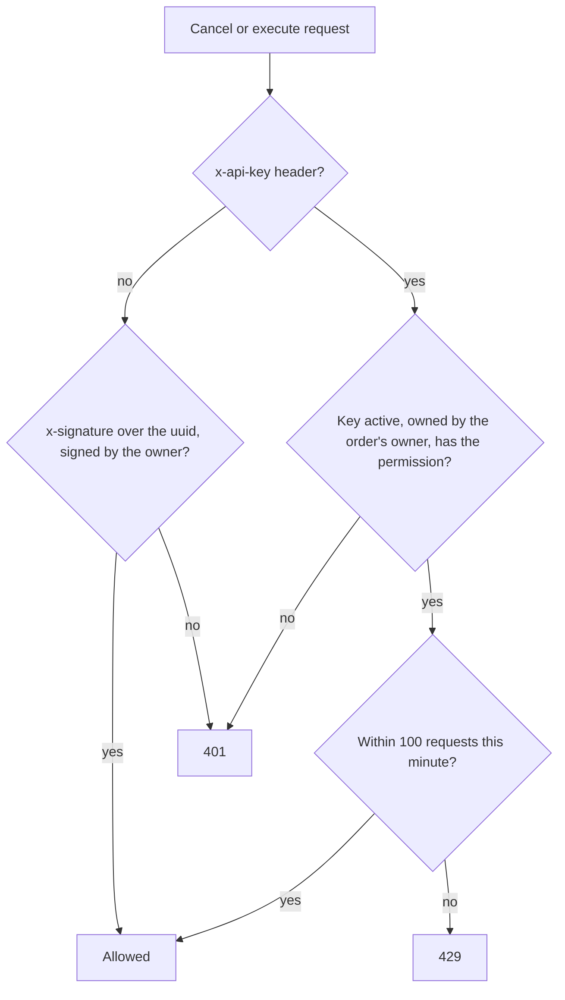

# Cancel or execute an order

Both calls act on a single order, and only its owner can make them, either with a wallet-signed message or with an API key for the owner's wallet.

## Authentication



**Signed message.** The owner signs the order's uuid string with `stx_signMessage`, then sends the result in the `x-signature` and `x-public-key` headers.

```ts
import { request } from '@stacks/connect';

const { signature, publicKey } = await request('stx_signMessage', { message: uuid });
await fetch(`https://swap.charisma.rocks/api/v1/orders/${uuid}/cancel`, {
  method: 'PATCH',
  headers: { 'x-signature': signature, 'x-public-key': publicKey },
});
```

In the Charisma monorepo, `blaze-sdk` does this in a single call: `signedFetch(url, { method: 'PATCH', message: uuid })`.

**API key.** Send `x-api-key: ck_live_…` using a key that belongs to the order's owner and has the `cancel` or `execute` permission. If an `x-api-key` header is present, signature headers are ignored. See [API keys](./api-keys.md).

```bash
curl -X POST "https://swap.charisma.rocks/api/v1/orders/<uuid>/execute" \
  -H "x-api-key: ck_live_<64 hex characters>"
```

## PATCH `/orders/{uuid}/cancel`

Cancel marks the order `cancelled`, so Charisma's executor will never run it. It returns `{ "status": "success", "data": <order> }`.

- An order that is already `confirmed`, `failed` or `cancelled` comes back unchanged, still with `200`.
- A `broadcasted` order can no longer be cancelled, because its swap is already on its way to the chain. This returns `409` and leaves the order alone.
- **The signature stays valid on-chain.** Cancelling only means Charisma will not submit it. The hard stop is withdrawing the funds from the subnet.

## POST `/orders/{uuid}/execute`

Execute runs an `open` order now. It ignores the order's price condition and time window.

Charisma's solver takes a fresh quote, broadcasts the swap through the order's `router` with deny-mode post-conditions (1% slippage limit), and pays the network fee. The response is `{ "status": "success", "txid": "…" }`.

The order moves to `broadcasted`, and the settlement job later marks it `confirmed` or `failed`. If the order belongs to a one-cancels-other group (Zesty exits, or orders with `metadata.oco`), the group's other open orders are cancelled.

## Responses

| Status | `error` | When |
| --- | --- | --- |
| `200` | — | The order was cancelled or executed. |
| `400` | `Order not open` | Execute only: the order is not `open`. |
| `400` | `Order execution failed: …` | Execute only: the broadcast was rejected. |
| `401` | `Signature verification failed` | The signature headers are missing or wrong, or the signer is not the owner. |
| `401` | `INVALID_API_KEY`, `API_KEY_INACTIVE`, `UNAUTHORIZED_WALLET`, `PERMISSION_DENIED` | The key is unknown, revoked or expired, belongs to another wallet, or lacks the permission. |
| `404` | `Not found` | No order has this uuid. |
| `409` | `Order already broadcast (txid …); it can no longer be cancelled` | Cancel only: the order is `broadcasted`. |
| `429` | `RATE_LIMIT_EXCEEDED` | The key is over its rate limit. The response includes the `X-RateLimit-*` headers. |
| `500` | `Execution failed` | Execute only: for example, no route was found. |

Auth errors look like `{ "error": "PERMISSION_DENIED", "timestamp": "2026-10-01T12:00:00.000Z" }`.
