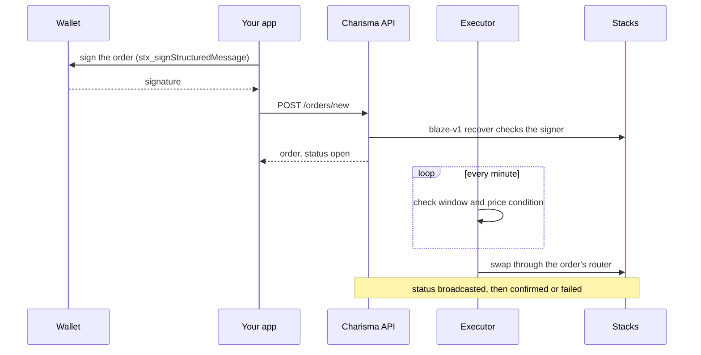

# Create an order

`POST /orders/new` stores a signed swap. Charisma's executor runs it when its price condition is met, on its next pass, or when you call execute.

An order spends the owner's **subnet** balance of `inputToken`, so the funds must be deposited to the subnet first. `GET /subnet-tokens` lists the subnet tokens.



## Sign the order

The owner signs a SIP-018 structured message for `blaze-v1`. It authorizes one transfer of `amountIn` of `inputToken` from their subnet balance to the router, and the `uuid` makes it single-use.

```ts
import { request } from '@stacks/connect';
import { Cl } from '@stacks/transactions';

const uuid = crypto.randomUUID();
const domain = Cl.tuple({
  name: Cl.stringAscii('BLAZE_PROTOCOL'),
  version: Cl.stringAscii('v1.0'),
  'chain-id': Cl.uint(1),
});
const message = Cl.tuple({
  contract: Cl.principal(inputToken), // a subnet token
  intent: Cl.stringAscii('TRANSFER_TOKENS'),
  opcode: Cl.none(),
  amount: Cl.some(Cl.uint(amountIn)),
  target: Cl.some(Cl.principal('SP2ZNGJ85ENDY6QRHQ5P2D4FXKGZWCKTB2T0Z55KS.x-multihop-v1')), // the router
  uuid: Cl.stringAscii(uuid),
});
const { signature } = await request('stx_signStructuredMessage', { domain, message });
```

There are two shortcuts:

- In the Charisma monorepo, `blaze-sdk`'s `signTriggeredSwap({ subnet: inputToken, uuid, amount: BigInt(amountIn) })` does the same thing. Its router defaults to `x-multihop-v1`.
- A bot that holds its own key can sign with `signStructuredData({ domain, message, privateKey })` from `@stacks/transactions`.

## Request body

| Field | Required | Description |
| --- | --- | --- |
| `owner` | Yes | The address that signed the order. |
| `inputToken` | Yes | The subnet token to spend. This is the signed `contract`. |
| `outputToken` | Yes | Contract ID of the token to receive. |
| `amountIn` | Yes | A positive integer string. This is the signed `amount`. |
| `recipient` | Yes | The address that receives the output. See [Recipient rule](#recipient-rule). |
| `signature` | Yes | The 65-byte signature as 130 hex characters, with no `0x`. |
| `uuid` | Yes | The signed `uuid`. Each uuid names exactly one order. |
| `router` | No | `…x-multihop-v1` or `…x-multihop-rc9`. If you leave it out, the API works it out from the signature. |
| `conditionToken` | For triggers | The token whose price is watched, or `"*"`. |
| `targetPrice` | For triggers | A decimal string with up to 18 decimals, `0` or more. |
| `direction` | For triggers | `gt` fires when the price is at or above `targetPrice`. `lt` fires when it is at or below. |
| `baseAsset` | No | The token prices are measured against. Defaults to `USD`. |
| `validFrom`, `validTo` | No | ISO 8601 times bounding when the order can run. `validTo` must be later than `validFrom`. |

Any other fields, such as `strategyId` or `metadata`, are stored with the order as sent.

## Order kinds

| Kind | What to send | When it runs |
| --- | --- | --- |
| Price-triggered | `conditionToken`, `targetPrice` and `direction`. Send all three or none. | Once `price(conditionToken) ÷ price(baseAsset)` is at or above (`gt`) or at or below (`lt`) `targetPrice`. If that is already true when you place the order, it runs on the next pass. The whole `amountIn` swaps at once. |
| Next pass | `conditionToken: "*"`, plus a `targetPrice` and `direction`, which are required but ignored (for example `"0"` and `"gt"`) | On the next executor pass, within about a minute. |
| Manual | No condition fields | Only when you call [`/execute`](./orders-cancel-execute.md). |
| Time window | `validFrom` and/or `validTo` on any of the kinds above | Only inside the window. The order is cancelled once `validTo` passes. A DCA is N `"*"` orders with back-to-back windows, each with its own uuid and signature. |
| One-cancels-other | The same `strategyId` and `metadata: { "oco": true }` on each order | When one order in the group runs, the group's other open orders are cancelled. |

## Recipient rule

- `x-multihop-v1` pays out only to the signer, so `recipient` must equal `owner`.
- Only signatures made for the legacy `x-multihop-rc9` router can pay a different address. That router lets whoever submits the signature choose where the output goes, which is why order signatures never leave Charisma's server.

## Example

```bash
curl -X POST https://swap.charisma.rocks/api/v1/orders/new \
  -H 'Content-Type: application/json' \
  -d '{
    "owner": "SP_OWNER_ADDRESS",
    "inputToken": "SP2ZNGJ85ENDY6QRHQ5P2D4FXKGZWCKTB2T0Z55KS.charisma-token-subnet-v1",
    "outputToken": "SM3VDXK3WZZSA84XXFKAFAF15NNZX32CTSG82JFQ4.sbtc-token",
    "amountIn": "100000000",
    "conditionToken": "SP2ZNGJ85ENDY6QRHQ5P2D4FXKGZWCKTB2T0Z55KS.charisma-token",
    "targetPrice": "0.05",
    "direction": "gt",
    "recipient": "SP_OWNER_ADDRESS",
    "router": "SP2ZNGJ85ENDY6QRHQ5P2D4FXKGZWCKTB2T0Z55KS.x-multihop-v1",
    "uuid": "7b1e2c34-5d6f-4a89-b0c1-d2e3f4a5b6c7",
    "signature": "<130 hex characters>"
  }'
```

This order sells 100 CHA for sBTC once CHA reaches $0.05. The response is `{ "status": "success", "data": <order> }`. The order holds every field you sent except `signature`, plus `"status": "open"` and `createdAt`. It uses the same shape as [Read orders](./orders.md).

## Responses

| Status | Body | When |
| --- | --- | --- |
| `200` | The order | It was created. Re-posting an existing uuid with the same signature also returns `200` with the stored order, so retries are safe. |
| `400` | `{ "error": "Invalid request", "details": ["amountIn: amountIn must be positive"] }` | The body failed validation. Each entry is `field: message`. |
| `400` | `Signature verification failed` | The signature does not recover to `owner` for this token, amount, router and uuid. |
| `400` | `recipient must equal owner: … pays out only to the signer` | The router is `x-multihop-v1` and `recipient` is not `owner`. |
| `400` | `inputToken must be a subnet token (got …); deposit to the subnet first` | `inputToken` is not a subnet token. |
| `400` | `Unknown router …` | `router` is not one of the two routers above. |
| `409` | `An order with uuid … already exists` | A different order already uses this uuid. |
