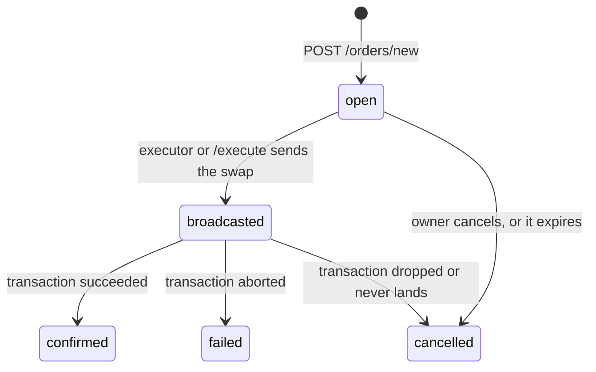

# Overview

An HTTP API for quoting swaps on Charisma and placing signed swap orders that Charisma runs for you.

**Base URL:** `https://swap.charisma.rocks/api/v1`

Requests and responses are JSON. Tokens are contract IDs, and STX is `.stx`. Order amounts are integer strings in the token's smallest unit. Only `/quote` sends CORS headers, so call every other endpoint from a server.

## Authentication

| Mode | Used by | How |
| --- | --- | --- |
| None | `/quote`, `/orders` reads, `/subnet-tokens`, `/balances` | Nothing to send. |
| Order signature | `POST /orders/new` | A SIP-018 signature in the body's `signature` field. See [Create an order](./orders-new.md). |
| Signed message | Cancel, execute, API-key management | The wallet signs a message with `stx_signMessage`. Send the result in the `x-signature` and `x-public-key` headers. |
| API key | Cancel, execute | Send the `x-api-key: ck_live_…` header. See [API keys](./api-keys.md). |

## Endpoints

| Method | Path | Auth | Purpose |
| --- | --- | --- | --- |
| `GET` | [`/quote`](./quote.md) | None | Find the best route and output for a swap |
| `POST` | [`/orders/new`](./orders-new.md) | Order signature | Create an order |
| `GET` | [`/orders`](./orders.md) | None | List orders |
| `GET` | [`/orders/{uuid}`](./orders.md#get-ordersuuid) | None | Get one order |
| `PATCH` | [`/orders/{uuid}/cancel`](./orders-cancel-execute.md) | Signed message or API key | Cancel an order |
| `POST` | [`/orders/{uuid}/execute`](./orders-cancel-execute.md) | Signed message or API key | Run an order now |
| `GET`, `POST` | [`/api-keys`](./api-keys.md) | Signed message | List or create API keys |
| `GET`, `DELETE` | [`/api-keys/{keyId}`](./api-keys.md) | Signed message | Get a key's stats, or revoke it |
| `GET` | `/subnet-tokens` | None | List subnet tokens. `pairings` maps each mainnet token to its subnet token. |
| `GET` | `/balances/{address}` | None | Get an address's STX, token and subnet balances. Add `?includeZero=true` to include zero balances. |

## Errors

| Endpoint | Error body |
| --- | --- |
| `/quote` | `{ "success": false, "error": "…" }` |
| `/orders/*` | `{ "error": "…" }`. An invalid `/orders/new` body also returns `"details": ["field: message"]`. |
| Auth failures and `/api-keys` | `{ "error": "…", "timestamp": "…" }`. Some also include `details`. |

The status code says what kind of failure it was: `400` bad input, `401` auth failed, `403` someone else's key, `404` not found, `409` uuid already used, `429` rate limited, `500` server error.

## Order lifecycle

| Status | Meaning | Fields that get set |
| --- | --- | --- |
| `open` | Waiting to run | `createdAt` |
| `broadcasted` | The swap transaction has been sent | `txid`, `broadcastedAt` |
| `confirmed` | The swap succeeded on-chain | `blockHeight`, `blockTime`, `confirmedAt` |
| `failed` | The transaction aborted on-chain | `failedAt`, `failureReason` (for example `abort_by_post_condition`) |
| `cancelled` | The order will never run | `cancelledAt` |

- **Executor.** It checks every `open` order once a minute. Price-triggered orders run when their condition is met, and `"*"` orders run on the next pass. Manual orders wait for [`/execute`](./orders-cancel-execute.md).
- **Settlement.** A second job, also running every minute, moves `broadcasted` orders to `confirmed` or `failed`. If the transaction is dropped, or has not landed 24 hours after `broadcastedAt`, the order becomes `cancelled`. Orders sent before `broadcastedAt` existed only have the 90-day limit.
- **Automatic cancellation.** An order is cancelled when its `validTo` passes, when it is 90 days old, when its `inputToken` turns out not to be a subnet token, or when a sibling exit runs (see [one-cancels-other](./orders-new.md#order-kinds)).
