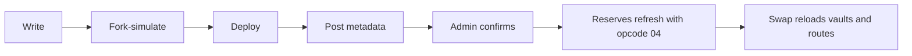

A new vault implements the trait, proves on a mainnet fork that its quotes match its swaps, and is registered before Charisma's router uses it.

## Checklist

| Must | Why |
|---|---|
| `(impl-trait 'SP2ZNGJ85ENDY6QRHQ5P2D4FXKGZWCKTB2T0Z55KS.dexterity-traits-v0.liquidity-pool-trait)` | Routers call `execute`; `dexterity-sdk` prices with `quote` |
| Dispatch on byte 0 and return an error for anything else | `none` reads as `0x00` |
| Move tokens to and from `tx-sender` | It is the user under `multihop` and the router under `x-multihop-v1` |
| `quote` reads the same live state `execute` uses | A quote that ignores pool state invents prices |
| `quote` equals `execute` at every size, both directions | Post-conditions are built from quotes |
| Pools answer `quote(0, 0x04)` | The reserves refresh reads it |
| `get-name`, `get-symbol`, `get-decimals`, `get-token-uri` | Registration and the token list read them |

## Fork-simulate first

:::danger Never call a route profitable until it has been fork-simulated
A listed vault once quoted a fixed 1:1 rate instead of reading its pool. The router saw a +51% STX-to-STX loop, and the real swap aborted on post-conditions. That vault is now block-listed.
:::

Test on a simnet fork of mainnet (the Clarinet SDK with remote data), with a real mainnet wallet as the sender. Devnet addresses fail mainnet `is-standard` checks.

- Compare `quote` with the real swap from tiny to large sizes, both directions. They must be equal.
- Swap through both routers, alone and next to a deep Charisma pool, with deny-mode post-conditions built the way each SDK builds them.
- Measure the quote's read cost. Hiro's public read-only API caps read length at 500 KB, so a quote that makes many external calls can fail over the API even when the swap works on-chain.

## Register it

| Step | Where | What |
|---|---|---|
| Metadata | `POST https://metadata.charisma.rocks/api/v1/metadata/<contractId>` | Name, symbol and image, signed by the deployer |
| Confirm | The **Import** button on Invest's `/pools` page, or `POST https://invest.charisma.rocks/api/v1/admin/vaults/<contractId>/confirm` | Admin only, with a signed `dex-cache-admin-access` message. Sends `type`, `protocol`, `tokenA` and `tokenB` in opcode order, `externalPoolId`, the fee as `lpRebatePercent`, and `stxWrapper` or `forwardsInputFee` when needed |
| Reserves | `/api/cron/update-reserves`, every 10 minutes | Calls `quote(0, 0x04)`. If that fails, reads the token balances of `externalPoolId`, or of the vault |
| Routing | Swap reloads its vault list every 10 minutes | The vault starts appearing in [`/quote`](../dex-api/quote.md) hops |

A vault that misbehaves is block-listed, which drops it from [`/vaults`](../data-apis/invest-api.md#get-vaults) and from routing.
