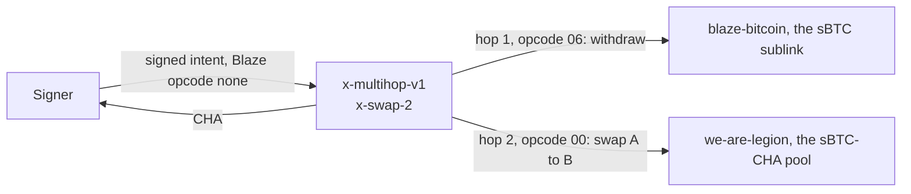

The opcode tells a vault which operation to run: a buffer of up to 16 bytes whose first byte is the operation.

## Reading it

Vaults read byte 0 like this (from the sublink template):

```clarity
(define-private (get-byte (opcode (optional (buff 16))) (position uint))
    (default-to 0x00 (element-at? (default-to 0x00 opcode) position)))
```

`none` or an empty buffer reads as `0x00`. A pool treats that as a swap from A to B; a sublink rejects it.

`dexterity-sdk` sends all 16 bytes, zero-padded:

```ts
export const opcodeCV = (op: number): ClarityValue => {
  const b = new Uint8Array(16).fill(0);
  b[0] = op;
  return someCV(bufferCV(b));
};
```

One byte works too: Invest's liquidity buttons send `02` and `03`.

## Operations

| Byte 0 | `OPCODES` name | `amount` | `dx` | `dy` | `dk` |
|---|---|---|---|---|---|
| `0x00` | `SWAP_A_TO_B` | Token A in | Input¹ | Token B out | 0 |
| `0x01` | `SWAP_B_TO_A` | Token B in | Input¹ | Token A out | 0 |
| `0x02` | `ADD_LIQUIDITY` | LP tokens to mint | Token A paid in | Token B paid in | LP minted |
| `0x03` | `REMOVE_LIQUIDITY` | LP tokens to burn | Token A paid out | Token B paid out | LP burned |
| `0x04` | `LOOKUP_RESERVES` | Ignored, send 0 | Reserve A | Reserve B | LP supply |
| `0x05` | `OP_DEPOSIT` | Tokens into the subnet | `amount` | `amount` | 0 |
| `0x06` | `OP_WITHDRAW` | Tokens out of the subnet | `amount` | `amount` | 0 |
| `0x07` | Not in the SDK | Ignored | Blocks since the last harvest² | Balance over that time² | Energy harvested² |

¹ Charisma pools report the input after their LP fee. Wrappers report the input consumed.
² From `execute`. `quote` returns 0, 0 and the blocks since the last harvest.

Contracts prefix every constant with `OP_` (`OP_SWAP_A_TO_B`, `OP_HARVEST_ENERGY`). `OPCODES` in `dexterity-sdk` drops the prefix for `0x00` to `0x04` and has no `0x07`.

## Who implements what

| Vault | `execute` | `quote` | Any other opcode |
|---|---|---|---|
| Charisma pool ([Launchpad template](https://launchpad.charisma.rocks/templates/liquidity-pool)) | `00` to `03` | `00` to `04` | `err u400` |
| Early Charisma pool, e.g. `charismatic-flow` | `00` to `03` | `00` to `03` | `err u400` |
| Sublink | `05`, `06` | `05`, `06` | `err u4002` |
| External DEX wrapper | `00`, `01` | `00`, `01`, `04` | `err u400` |
| `energize-v1` | `07` | `07` | `err u4002` |

| Caller | Sends |
|---|---|
| `dexterity-sdk` Router, building a route | `00`, `01`, `05` into a subnet, `06` out of one |
| Invest, adding and removing liquidity | `02`, `03` |
| Invest, refreshing reserves | `04` |

## Room to grow

- Byte 0 has 256 values. `0x00` to `0x07` are taken.
- No vault reads bytes 1 to 15 yet. They are room for an operation's parameters.
- A new operation needs a vault that understands it and a caller that sends it. The trait, the routers and existing vaults stay as they are.

## Not the Blaze opcode

Blaze intents also have an `opcode` field of the same type, with a different job.

| | Dexterity opcode | Blaze opcode |
|---|---|---|
| Lives in | Each `execute` or `quote` call, one per hop | A signed intent |
| Set by | Whoever builds the transaction | The signer, inside the signature |
| Says | Which operation a vault runs | Extra terms the signer commits to |
| Used today | Every vault call | Never: always `none` |

Both appear in one Blaze swap:



See [Signing: the opcode field](../blaze-api/signing.md#the-opcode-field).
