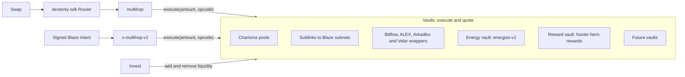

A vault is the modular unit of trading: any contract with Dexterity's two functions, so every router and app can call it the same way.

## The trait

From `SP2ZNGJ85ENDY6QRHQ5P2D4FXKGZWCKTB2T0Z55KS.dexterity-traits-v0`:

```clarity
(define-trait liquidity-pool-trait
  (
    (execute
      (uint (optional (buff 16)))
      (response (tuple (dx uint) (dy uint) (dk uint)) uint))
    (quote
      (uint (optional (buff 16)))
      (response (tuple (dx uint) (dy uint) (dk uint)) uint))
  )
)
```

| Function | Takes | Does |
|---|---|---|
| `execute` | An amount and an [opcode](./opcodes.md) | Runs the operation the opcode names, for `tx-sender` |
| `quote` | The same | Read-only. Returns what `execute` would return now |

Both return `{dx, dy, dk}`. What the numbers mean depends on the [operation](./opcodes.md#operations). Routers read only `dy`: each hop's `dy` is the next hop's amount.

The trait says "liquidity pool" because Charisma's AMM pools came first, and each one is an AMM, an LP token and a vault in a single contract. Everything else that implements the trait is a vault too.

## Why one interface

A router doesn't know what a hop is. `multihop` calls whatever contract each hop names:

```clarity
(define-private (execute-swap
    (amount uint)
    (hop {pool: <pool-trait>, opcode: (optional (buff 16))}))
  (let ((pool (get pool hop)))
    (contract-call? pool execute amount (get opcode hop))))
```

So a Charisma pool, a subnet bridge and a Bitflow pool are interchangeable hops. A new vault can be routed through the day it's deployed, with no change to any router.

| Router | Calls vaults as | Entry points | Started by |
|---|---|---|---|
| `SP2ZNGJ85ENDY6QRHQ5P2D4FXKGZWCKTB2T0Z55KS.multihop` | The user | `swap-1` to `swap-9` | A wallet transaction |
| `SP2ZNGJ85ENDY6QRHQ5P2D4FXKGZWCKTB2T0Z55KS.x-multihop-v1` | Itself (`as-contract`) | `x-swap-1` to `x-swap-5` | A signed [Blaze intent](../blaze-api/routers.md) |

`dexterity-sdk` (npm, source in `packages/dexterity`) finds routes across every registered vault and builds the `multihop` call.



[Vault kinds](./vault-kinds.md) covers each one. [Build a vault](./build-a-vault.md) covers adding one.

## Where this is going

:::info Direction, not built yet
`execute` can do anything a contract can do. Today vaults swap, add and remove liquidity, report reserves, move tokens in and out of subnets, harvest Hold-to-Earn energy, and pay out farm rewards for energy. The same two functions could front lending, staking or any other DeFi operation on Stacks, each behind a new opcode. Every router could call such a vault as it is; an app would only need to know the new opcode. That makes the vault a candidate building block for all of DeFi on Stacks. No vault beyond the kinds above exists yet.
:::
