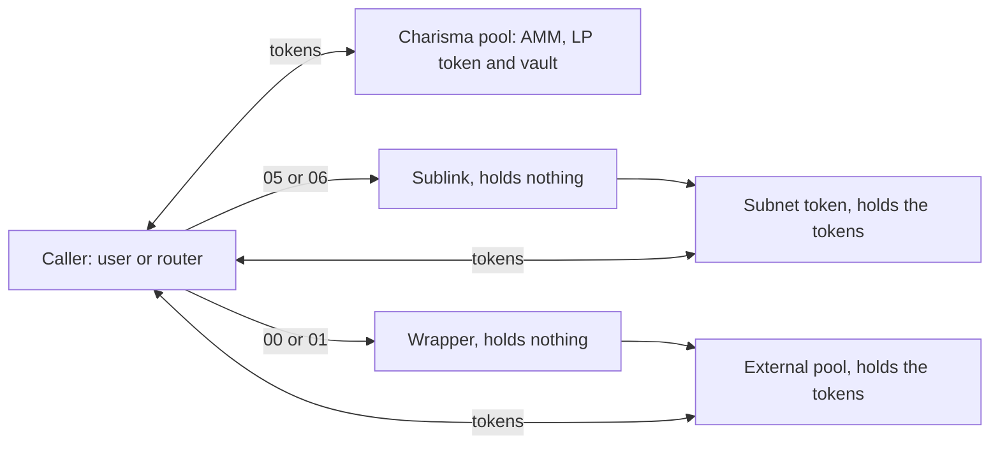
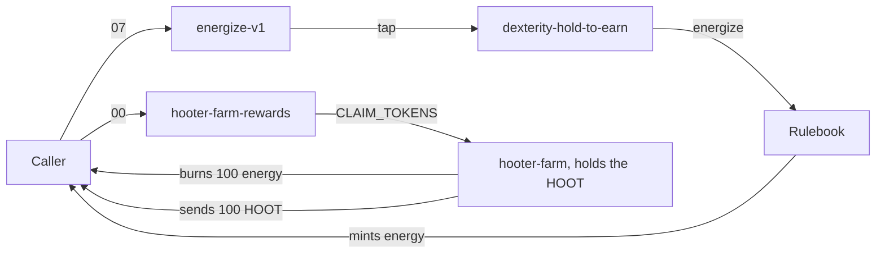

Five kinds of vault are on-chain. Three route swaps: Charisma pools, sublinks to Blaze subnets, and wrappers around other DEXes' pools. Two pay rewards: energy vaults and reward vaults.

| Kind | Registry `type` / `protocol` | Example | Tokens sit in | Opcodes (`execute` / `quote`) |
|---|---|---|---|---|
| Charisma pool | `POOL` / `CHARISMA` | `SP2ZNGJ85ENDY6QRHQ5P2D4FXKGZWCKTB2T0Z55KS.sbtc-usdh-amm-lp-v1` | The pool contract | `00` to `03` / `00` to `04` |
| Sublink | `SUBLINK` / `CHARISMA` | `SP2ZNGJ85ENDY6QRHQ5P2D4FXKGZWCKTB2T0Z55KS.blaze-bitcoin` | The subnet token, `sbtc-token-subnet-v1` | `05`, `06` / `05`, `06` |
| External wrapper | `POOL` / `BITFLOW`, `ALEX`, `ARKADIKO`, `VELAR` | `SP2ZNGJ85ENDY6QRHQ5P2D4FXKGZWCKTB2T0Z55KS.bitflow-welsh-stx` | The external pool | `00`, `01` / `00`, `01`, `04` |
| Energy vault | `ENERGY` / `CHARISMA` | `SP2ZNGJ85ENDY6QRHQ5P2D4FXKGZWCKTB2T0Z55KS.energize-v1` | Nothing: energy is minted | `07` / `07` |
| Reward vault | Not registered | `SP2ZNGJ85ENDY6QRHQ5P2D4FXKGZWCKTB2T0Z55KS.hooter-farm-rewards` | The farm, `hooter-farm` | `00`, `01` / `00`, `01`, `04` |

The [Invest API](../data-apis/invest-api.md#get-vaults) serves the registry.



## Charisma pools: the AMM is the vault

One contract is the x·y=k AMM, the SIP-010 LP token and the vault. It holds both reserves, keeps its fee (`LP_REBATE`, on a 1,000,000 scale) for liquidity providers, and dispatches on the opcode:

```clarity
(define-public (execute (amount uint) (opcode (optional (buff 16))))
    (let (
        (sender tx-sender)
        (operation (get-byte (default-to 0x00 opcode) u0)))
        (if (is-eq operation OP_SWAP_A_TO_B) (swap-a-to-b amount)
        (if (is-eq operation OP_SWAP_B_TO_A) (swap-b-to-a amount)
        (if (is-eq operation OP_ADD_LIQUIDITY) (add-liquidity amount)
        (if (is-eq operation OP_REMOVE_LIQUIDITY) (remove-liquidity amount)
        ERR_INVALID_OPERATION))))))
```

Launchpad's [liquidity-pool template](https://launchpad.charisma.rocks/templates/liquidity-pool) generates this contract (`apps/launchpad/src/lib/templates/liquidity-pool-contract-template.ts`). Early pools such as `charismatic-flow` (STX-CHA) predate `0x04`, so the reserves refresh reads their token balances instead.

## Sublinks: subnets as vaults

A [subnet token](../blaze-api/subnet-tokens.md) is Blaze's balance ledger, not a vault. Subnets came after vaults, so each one gets a separate vault wrapper, its sublink, that lets a router move tokens in or out of the subnet as a hop. It is 1:1 with no fee:

```clarity
(define-public (withdraw (amount uint) (recipient principal))
    (begin
        (try! (contract-call? '{{SUBNET_CONTRACT}} withdraw amount (some recipient)))
        (ok {dx: amount, dy: amount, dk: u0})))
```

- `0x05` takes the caller's tokens and credits the caller's subnet balance. `0x06` does the reverse.
- Launchpad's [subnet-wrapper](https://launchpad.charisma.rocks/templates/subnet-wrapper) template makes the subnet token; its [sublink](https://launchpad.charisma.rocks/templates/sublink) template makes the vault.
- In the registry, `tokenA` is the base token and `tokenB` the subnet token.
- A Blaze swap normally starts with the sublink and `0x06`. See [Swap routers](../blaze-api/routers.md).

## External DEX wrappers: other pools, one interface

A wrapper normalises another DEX's pool behind the trait. It holds no tokens. `execute` calls the external protocol with the caller still `tx-sender`, so tokens move straight between the caller and the external pool. Sources are in `packages/clarity/contracts/vaults`, and each one is deployed by `SP2ZNGJ85ENDY6QRHQ5P2D4FXKGZWCKTB2T0Z55KS`.

| Protocol | Example | `externalPoolId` | `quote` replays |
|---|---|---|---|
| Bitflow XYK | `bitflow-welsh-stx` | `SM1793C4R5PZ4NS4VQ4WMP7SKKYVH8JZEWSZ9HCCR.xyk-pool-welsh-stx-v-1-1` | The pool's fees, then x·y=k |
| Bitflow DLMM | `bitflow-stx-sbtc` | `SM1FKXGNZJWSTWDWXQZJNF7B5TV5ZB235JTCXYXKD.dlmm-pool-stx-sbtc-v-1-bps-15` | `dlmm-core-v-1-1` bin math, over the same 350 bins the swap walks |
| ALEX | `alex-stx-welsh` | `SP102V8P0F7JX67ARQ77WEA3D3CFB5XW39REDT0AM.amm-vault-v2-01` | The pool fee, then `get-y-given-x` or `get-x-given-y` in 8-decimal fixed point |
| Arkadiko | `arkadiko-stx-usda` | `SP2C2YFP12AJZB4MABJBAJ55XECVS7E4PMMZ89YZR.arkadiko-swap-v2-1` | A 0.3% fee, then x·y=k on the pair balances |
| Velar | `velar-stx-sbtc` | `SP20X3DC5R091J8B6YPQT638J8NR1W83KN6TN5BJY.univ2-pool-v1_0_0-0070` | The fees contract's `calc-fees`, then `univ2-math` `find-dx` |

| Rule | Why |
|---|---|
| `externalPoolId` is the contract that holds and sends the tokens | Deny-mode post-conditions expect each hop's output from `externalPoolId`, or from the vault when it's empty |
| `quote` replays the pool's own math, to the unit | Routes, prices and slippage bounds all come from quotes |
| No `as-contract` | It would change the sender, and the post-conditions would fail |
| Token A and B in the registry follow the pool's order | `0x00` means A to B |
| Swaps only, by choice | A wrapper could add and remove liquidity with `0x02` and `0x03`. Charisma's don't: Charisma doesn't put liquidity in other DEXes' pools, and each protocol's liquidity flow is its own work to build and maintain (Bitflow DLMM shares, for one, aren't SIP-010 tokens) |
| Unusual token moves are declared | Arkadiko's STX pairs set `stxWrapper` (wSTX is minted and burned mid-swap). Velar vaults set `forwardsInputFee` (the pool sends part of the input to a fee contract) |

## Energy vaults: harvest Hold-to-Earn

An energy vault puts a [Hold-to-Earn](../tokenomics/hold-to-earn.md) engine behind the vault interface. `energize-v1` is the one on-chain. `0x07` calls its engine's `tap`, which measures how many DEX LP tokens (`dexterity-pool-v1`) the caller held since their last harvest, and the rulebook mints them that much energy. `amount` is ignored.

```clarity
(define-public (execute (amount uint) (opcode (optional (buff 16))))
    (let ((operation (get-byte opcode u0)))
        (if (is-eq operation OP_HARVEST_ENERGY) (harvest-energy)
        ERR_INVALID_OPERATION)))

(define-public (harvest-energy)
    (contract-call? 'SP2D5BGGJ956A635JG7CJQ59FTRFRB0893514EZPJ.dexterity-hold-to-earn tap))
```

- `execute` returns the engine's result: `dx` blocks since the last harvest, `dy` the balance over that time, `dk` the energy minted.
- `quote` returns only `dk`, the blocks since the caller's last harvest.
- In the registry, `engineContractId` names the engine and `tokenA` and `tokenB` are empty.

## Reward vaults: spend energy, get tokens

A reward vault turns a farm into a swap. `hooter-farm-rewards` wraps the Hooter Farm: `0x00` burns 100 of the caller's energy, and the farm sends them 100 HOOT from its own balance. The amount is fixed. Any `amount` of 100 energy or more quotes 100 for 100; less quotes 0.

```clarity
(define-private (spend-energy (amount uint))
    (begin
        (asserts! (>= amount BURN-AMOUNT) ERR_INVALID_AMOUNT)
        (match (contract-call? .hooter-farm execute .charisma-rulebook-v0 "CLAIM_TOKENS")
            success true
            error false)
        (ok {dx: BURN-AMOUNT, dy: BURN-AMOUNT, dk: u0})))
```

| Opcode | What it does |
|---|---|
| `00` | Burns 100 energy and pays 100 HOOT |
| `01` | Nothing. Returns zeros |
| `04`, `quote` only | `dx` is energy's total supply, `dy` the HOOT left in the farm |

:::caution A failed claim still returns `ok`
`spend-energy` discards the farm's result. With too little energy, or an empty farm, `execute` still reports 100 for 100. Check the HOOT that arrived, or set post-conditions.
:::

Because it is a vault, routers can call it. `hooter-farm-x10` claims ten times in one transaction by calling `multihop` `swap-1` with `hooter-farm-rewards` ten times. The vault isn't in the registry, so `dexterity-sdk` routes and the Invest API don't include it.


