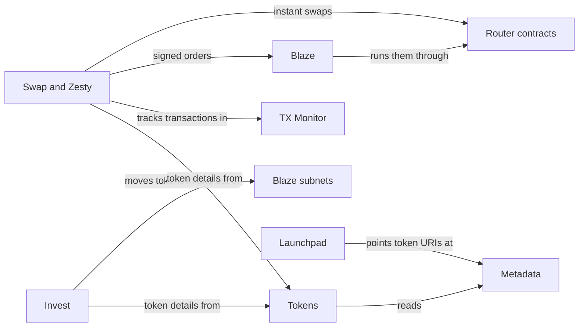

# Start here

Charisma is a set of open-source DeFi apps on Stacks. The code is on [GitHub](https://github.com/r0zar/charisma).

## Apps

| App | Domain | What it does |
|---|---|---|
| Swap | [swap.charisma.rocks](https://swap.charisma.rocks) | Instant swaps, triggered orders, DCA, range and in-and-out strategies |
| Zesty | [zesty.charisma.rocks](https://zesty.charisma.rocks) | Part of Swap: pick a side on ZEST and it sells for you later |
| Invest | [invest.charisma.rocks](https://invest.charisma.rocks) | Liquidity pools, vaults, subnets and Hold-to-Earn |
| Launchpad | [launchpad.charisma.rocks](https://launchpad.charisma.rocks) | Deploy tokens and liquidity pools from templates |
| Metadata | [metadata.charisma.rocks](https://metadata.charisma.rocks) | Create and host token metadata |
| Tokens | [tokens.charisma.rocks](https://tokens.charisma.rocks) | Search SIP-010 tokens and read their data by API |
| TX Monitor | [tx.charisma.rocks](https://tx.charisma.rocks) | Follow transactions from broadcast to confirmation |
| Docs | [docs.charisma.rocks](https://docs.charisma.rocks) | This site |
| Brand | [brand.charisma.rocks](https://brand.charisma.rocks) | Logo, colours, type and components |

## How they connect

## Where to start

| If you want to | Read |
|---|---|
| Quote, place and manage swaps over HTTP | [DEX API](./dex-api/overview.md) |
| Sign once and let someone run it later | [Blaze](./blaze-api/introduction.md) |
| Understand token prices | [Prices](./prices/overview.md) |
| Read Charisma data over HTTP | [Data APIs](./data-apis/overview.md) |
| Learn how CHA, ENERGY and governance work | [Tokenomics](./tokenomics/cha.md) |
