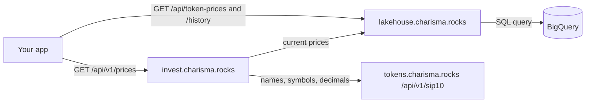
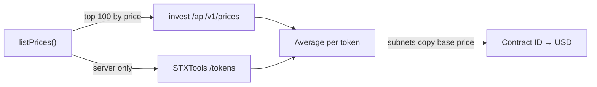

# Prices API

Read current and historical token prices over HTTP, or through `@repo/tokens` inside the monorepo.



Both hosts are public, need no key and allow any origin.

## Invest: prices with metadata

### `GET https://invest.charisma.rocks/api/v1/prices`

| Param | Default | Notes |
|---|---|---|
| `token` | none | Contract ID. Returns 0 or 1 entries. |
| `limit` | `100` | 1–1000. Anything else returns 500. |
| `minPrice` | `0` | Minimum USD price. |

Sorted by `usdPrice`, highest first. Sample `?limit=2`:

```json
{
  "status": "success",
  "data": [
    {
      "tokenId": "SP3DX3H4FEYZJZ586MFBS25ZW3HZDMEW92260R2PR.Wrapped-Bitcoin",
      "symbol": "xBTC",
      "name": "Wrapped Bitcoin",
      "decimals": 8,
      "image": "https://assets.hiro.so/api/mainnet/token-metadata-api/SP3DX3H4FEYZJZ586MFBS25ZW3HZDMEW92260R2PR.Wrapped-Bitcoin/1.png",
      "usdPrice": 108275.811917799,
      "sbtcRatio": 1.273045291,
      "confidence": 1,
      "lastUpdated": 1790907317895,
      "totalLiquidity": 0,
      "isLpToken": false,
      "intrinsicValue": 108275.811917799,
      "marketPrice": 108275.811917799
    },
    {
      "tokenId": "SP14NS8MVBRHXMM96BQY0727AJ59SWPV7RMHC0NCG.pontis-bridge-pBTC",
      "symbol": "pBTC",
      "name": "Pontis Bitcoin",
      "decimals": 8,
      "image": "https://assets.hiro.so/api/mainnet/token-metadata-api/SP14NS8MVBRHXMM96BQY0727AJ59SWPV7RMHC0NCG.pontis-bridge-pBTC/1.png",
      "usdPrice": 86831.750687487,
      "sbtcRatio": 1.02091824,
      "confidence": 1,
      "lastUpdated": 1790907317895,
      "totalLiquidity": 0,
      "isLpToken": false,
      "intrinsicValue": 86831.750687487,
      "marketPrice": 86831.750687487
    }
  ],
  "metadata": {
    "count": 2,
    "totalTokensAvailable": 63,
    "processingTimeMs": 1973,
    "lakehouseData": true,
    "lastUpdated": "2026-10-02T02:15:17.895Z",
    "queryParams": { "token_filter": null, "limit": 2, "min_price": 0 }
  }
}
```

### `GET https://invest.charisma.rocks/api/v1/prices/{contractId}`

One token under `data`, same fields. `?details=true` adds `calculationDetails` (`priceSource`, `calculatedAt` and two always-0 fields).

### Fields

| Field | Meaning |
|---|---|
| `tokenId` | Contract ID. Use it as the key. |
| `usdPrice` | USD per whole token. |
| `sbtcRatio` | sBTC per whole token. |
| `lastUpdated` | When the job wrote this price, Unix ms. |
| `symbol`, `name`, `decimals`, `image` | From `tokens.charisma.rocks/api/v1/sip10`; placeholders when missing. |
| `confidence`, `totalLiquidity`, `isLpToken`, `intrinsicValue`, `marketPrice` | Legacy: always `1`, `0`, `false`, `usdPrice`, `usdPrice`. |

| Status | When |
|---|---|
| 200 | Success. An unknown `token` returns `data: []`. |
| 404 | `/prices/{contractId}` has no price: `{"status":"error","error":"Token not found",...}` |
| 500 | Lakehouse or metadata fetch failed, or bad `limit`. |

Cache: `public, s-maxage=300, stale-while-revalidate=900`, so a response can trail the latest run by 20 minutes or more.

## Lakehouse: raw prices

No metadata, snake_case fields, straight from BigQuery.

### `GET https://lakehouse.charisma.rocks/api/token-prices`

The latest row per token, sorted by `usd_price`, highest first.

| Param | Default | Notes |
|---|---|---|
| `token` | none | Contract ID. |
| `limit` | `100` | Integer, 1–1000. |
| `minPrice` | `0` | USD, 0 or more. |

Sample `?limit=2&minPrice=0.05`:

```json
{
  "prices": [
    {
      "token_contract_id": "SP3DX3H4FEYZJZ586MFBS25ZW3HZDMEW92260R2PR.Wrapped-Bitcoin",
      "sbtc_price": 1.273045291,
      "usd_price": 108275.811917799,
      "price_source": "multihop_quote",
      "iterations_to_converge": 0,
      "final_convergence_percent": 0,
      "calculated_at": "2026-10-02T02:15:17.895Z"
    },
    {
      "token_contract_id": "SP14NS8MVBRHXMM96BQY0727AJ59SWPV7RMHC0NCG.pontis-bridge-pBTC",
      "sbtc_price": 1.02091824,
      "usd_price": 86831.750687487,
      "price_source": "multihop_quote",
      "iterations_to_converge": 0,
      "final_convergence_percent": 0,
      "calculated_at": "2026-10-02T02:15:17.895Z"
    }
  ],
  "summary": {
    "total_tokens": 22,
    "min_price": 0.092012633,
    "max_price": 108275.811917799,
    "avg_price": 18273.431916046,
    "last_updated": "2026-10-02T02:15:17.895Z"
  },
  "query_params": { "token_filter": null, "limit": 2, "min_price": 0.05 }
}
```

`price_source` is `multihop_quote` from the current job; older rows (VELAR's, for one) say `tvl_weighted_iteration`.

### `GET https://lakehouse.charisma.rocks/api/token-prices/history`

Raw rows for one token, newest first: one row per 5-minute run.

| Param | Default | Notes |
|---|---|---|
| `token` | required | Contract ID. |
| `start`, `end` | last 30 days | ISO date or timestamp. The default applies only when both are missing. |
| `limit` | `1000` | Integer, 1–10000. |

`interval` is validated but not applied: rows are never grouped, so `min_usd_price` and `max_usd_price` equal `usd_price` and `data_points` is 1. `summary.price_statistics` covers the whole window, not just the returned rows.

```json
{
  "price_history": [
    {
      "timestamp": "2026-10-02T02:15:17.895Z",
      "sbtc_price": 1.082e-06,
      "usd_price": 0.092012633,
      "min_usd_price": 0.092012633,
      "max_usd_price": 0.092012633,
      "data_points": 1
    },
    {
      "timestamp": "2026-10-02T02:10:33.949Z",
      "sbtc_price": 1.082e-06,
      "usd_price": 0.092026913,
      "min_usd_price": 0.092026913,
      "max_usd_price": 0.092026913,
      "data_points": 1
    }
  ],
  "summary": {
    "token_contract_id": "SP2ZNGJ85ENDY6QRHQ5P2D4FXKGZWCKTB2T0Z55KS.charisma-token",
    "total_days": 31,
    "data_range": { "start": "2026-09-02T03:00:25.569Z", "end": "2026-10-02T02:15:17.895Z" },
    "price_statistics": { "all_time_min": 0.048658298, "all_time_max": 0.092747251, "average_price": 0.06862098 },
    "total_data_points": 2
  },
  "query_params": { "token": "SP2ZNGJ85ENDY6QRHQ5P2D4FXKGZWCKTB2T0Z55KS.charisma-token", "start_date": null, "end_date": null, "interval": "hour", "limit": 2 }
}
```

| Status | When |
|---|---|
| 200 | Success. An unknown token returns an empty list. |
| 400 | Bad `limit`, `minPrice`, `start`, `end` or `interval`, or no `token` on `/history`: `{"error":"..."}` |
| 500 | BigQuery failed. |

Cache: current prices `s-maxage=300`; history `s-maxage=7200, stale-while-revalidate=86400`, so history can trail by 2 hours or more.

## `@repo/tokens`

```ts
import { listPrices, lakehouseClient } from '@repo/tokens';

const CHA = 'SP2ZNGJ85ENDY6QRHQ5P2D4FXKGZWCKTB2T0Z55KS.charisma-token';

const prices = await listPrices(); // { [contractId]: usdPrice }
const chaUsd = prices[CHA];

const rows = await lakehouseClient.getCurrentPrices({ limit: 1000 });
const history = await lakehouseClient.getPriceHistory(CHA, { start: '2026-09-01', limit: 10000 });
```

### `listPrices()`



- On the server it averages STXTools with the invest API. The browser skips STXTools, so server and browser can disagree.
- 5-second timeout per source. Returns `{}`, not an error, when every source fails.
- It asks invest for `limit=100`, so only the 100 highest-priced tokens come from Charisma.
- `listPricesInternal()` and `listPricesSTXTools()` use one source each.

### `lakehouseClient`

| Method | Returns | On error |
|---|---|---|
| `getCurrentPrices({ token?, limit?, minPrice? })` | `LakehousePricePoint[]` | Throws |
| `getTokenPrice(contractId)` | `LakehousePricePoint \| null` | `null` |
| `getPriceHistory(contractId, { start?, end?, limit? })` | `LakehouseHistoryPoint[]` | Throws |
| `getPriceHistoryWithFallback(contractId, { limit? })` | `LakehouseHistoryPoint[]` | `[]` |

Default timeout 10 seconds (`new LakehouseClient({ timeout })`). It always calls production, while `listPrices()` calls `localhost:3003` in development unless `NEXT_PUBLIC_DISCOVERY_USE_PRODUCTION` lists `invest` or `all`.

## Gotchas

- All the [known limits](./overview.md#known-limits) apply: key on contract ID (two different tokens even share the symbol `B`) and check `lastUpdated`.
- Prices are stored to 9 decimal places, so cheap tokens round down: PEPE shows `sbtcRatio: 0`. Use `usdPrice`.
- History's default `limit` of 1000 rows covers about 3.5 days. Pass `limit=10000` for the full 30.
- `getPriceHistoryWithFallback` defaults to 24 rows: 2 hours, not 24.
- Rows before 2026-10-01 00:35 UTC are hourly, from earlier versions of the job.
- Uncached invest requests take about 2 seconds (it fetches the whole metadata list). Call the lakehouse directly if you don't need metadata.
