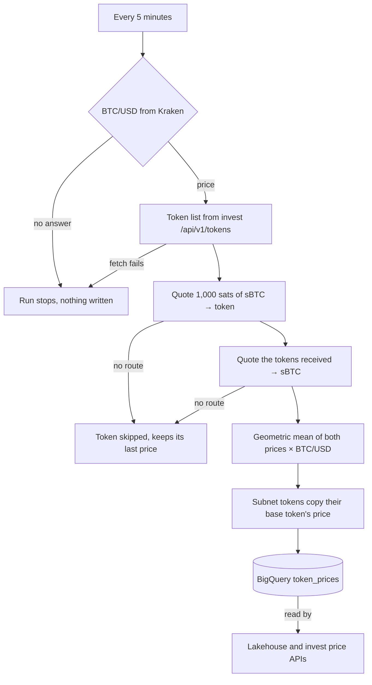

# How prices work

Every 5 minutes a job prices each token by swapping a little sBTC into it and back out through the Charisma router.

## The anchor

sBTC is priced at 1 BTC, and BTC/USD is Kraken's last trade price. Kraken is the only source. If it doesn't answer, the run stops and writes nothing, so prices go stale rather than wrong.

## Each run

| Step | Detail |
|---|---|
| Tokens | Every token in `https://invest.charisma.rocks/api/v1/tokens` except sBTC and subnet tokens. |
| Quotes | `https://swap.charisma.rocks/api/v1/quote`, 1,000 sats (0.00001 sBTC) in. |
| Mid price | The buy price pays fees going in and the sell price pays them coming out. Their geometric mean cancels the fees. |
| Subnets | A subnet token (`type: SUBNET`) gets its base token's price, if the base priced in this run. |
| Storage | One row per token, all sharing one timestamp. |

Source: [`scripts/calculate-token-prices.ts`](https://github.com/r0zar/lakehouse/blob/main/scripts/calculate-token-prices.ts) in the lakehouse repo.

## Routes

The router (`dexterity-sdk`) searches paths of up to 4 hops through Charisma pools and wrapped external pools from Bitflow, ALEX, Arkadiko and Velar. Bitflow DLMM (bin) pools and stableswaps don't reveal a price from their reserves, so the router probes each with a tiny live quote (`withSpotPrices`) to rank routes. The top-ranked routes are then quoted on-chain, and the best output wins.

Stablecoins get no special treatment. There is no $1 override: a stablecoin is worth whatever its route says.

## Known limits

Examples are live readings from 1 October 2026.

| Limit | Example | What to do |
|---|---|---|
| Thin routes misprice. A price is only as good as the pools on its best route. | xBTC reads $108,276 (1.27 sBTC). Its route is sBTC → STX → USDA → xBTC, ending in a small Arkadiko pool. USDA reads $1.49 through a 4-hop route. | Sanity-check before relying on a price. Bitcoin wrappers should sit near 1 sBTC; stablecoins near $1. |
| Stale rows never expire. The latest row per token is served however old it is. | VELAR's price was last written 29 July 2025. | Check `lastUpdated`. More than a few runs old means stale. |
| Subnet duplicates share a symbol. | Two `sBTC` entries: `SM3VDXK3WZZSA84XXFKAFAF15NNZX32CTSG82JFQ4.sbtc-token` and its subnet `SP2ZNGJ85ENDY6QRHQ5P2D4FXKGZWCKTB2T0Z55KS.sbtc-token-subnet-v1`. | Key on contract ID, never symbol. |
| Unknown tokens show placeholder metadata. | A priced token missing from the metadata list returns `"symbol": "UNKNOWN"`, `"name": "Unknown Token"`, `"decimals": 6`, `"image": ""`. | Don't use `decimals` for amount math when `symbol` is `UNKNOWN`. |

See [Prices API](./api-reference.md) for endpoints and fields.
