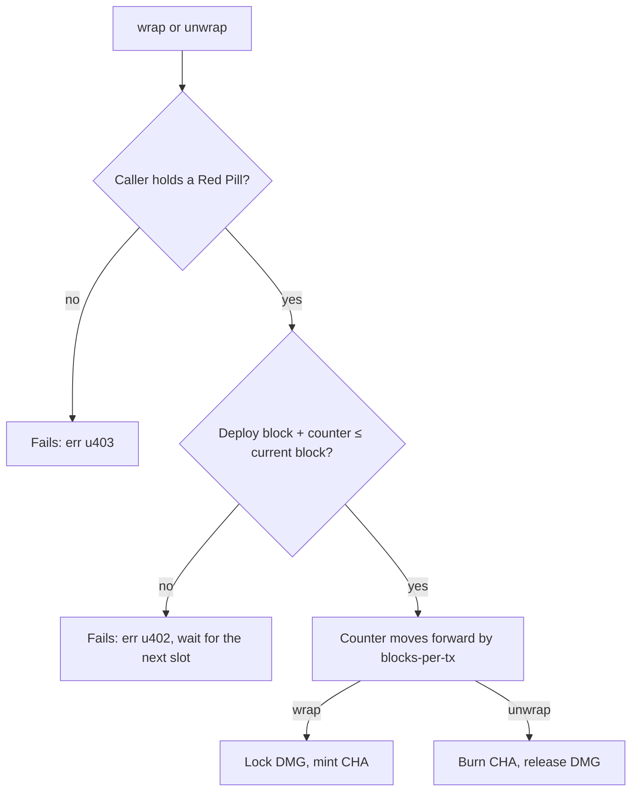

# CHA

CHA is Charisma's main token. New CHA only comes from wrapping DMG 1:1 (a Legacy path, still live), and wrapping is rate-limited on-chain.

Contract: [`SP2ZNGJ85ENDY6QRHQ5P2D4FXKGZWCKTB2T0Z55KS.charisma-token`](https://explorer.hiro.so/txid/SP2ZNGJ85ENDY6QRHQ5P2D4FXKGZWCKTB2T0Z55KS.charisma-token?chain=mainnet). Live supply: `get-total-supply`.

## Wrap, unwrap and burn

| Call | What happens | Amount limit |
|---|---|---|
| `wrap` | Locks your DMG, mints equal CHA | `max-liquidity-flow`; larger requests are cut to it |
| `unwrap` | Burns your CHA, releases equal DMG | None. The code's cap only applies to wallets without a Red Pill, which can't call it |
| `burn` | Destroys your CHA; its DMG stays locked | None, and no throttle |

Everyone shares one counter. It started at the deploy block, so unused slots pile up and can be used back to back (`get-txs-available`; `get-blocks-until-unlock` shows the wait). "Block" means Stacks tenure height, which moves at most once per Bitcoin block.

## Mint ceiling

Live values on 1 October 2026:

| Read-only call | Value | Bounds the DAO can set |
|---|---|---|
| `get-blocks-per-tx` | 1,440 (about 10 days of Bitcoin blocks) | 1 to 100,000 |
| `get-max-liquidity-flow` | 1 CHA | 1 to 1,000 CHA |

~52,560 Bitcoin blocks a year ÷ 1,440 = at most **~36.5 CHA a year**, plus any open slots. Tenures recently ran slower than Bitcoin blocks, so the real pace is lower. The DAO can move both settings within the bounds ([Governance](./governance.md)).

## Red Pill gate

`wrap` and `unwrap` require a [Red Pill](https://explorer.hiro.so/txid/SP2ZNGJ85ENDY6QRHQ5P2D4FXKGZWCKTB2T0Z55KS.red-pill-nft?chain=mainnet). The check is hard-coded; nobody can remove it.

- Soulbound: `transfer` always fails.
- Minting is open at the time of writing (`get-paused` is false): one per wallet, up to `get-mint-limit`, costing `get-price` µSTX unless you're on the original free-claim list.
