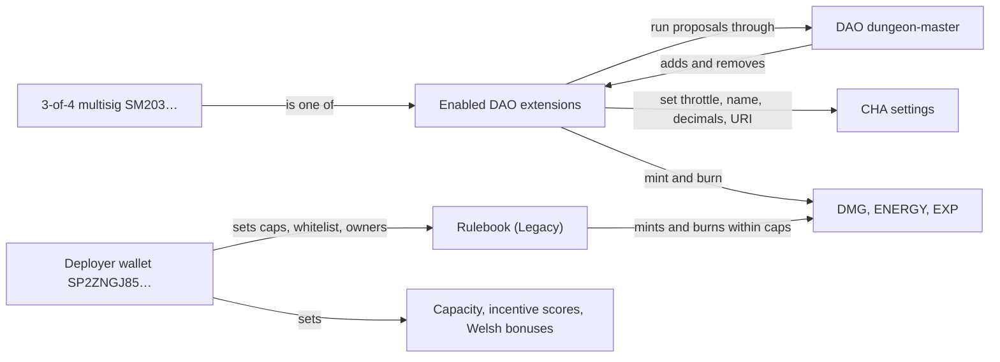

# Governance

Who can change what, as the contracts stand today. Most setters emit no events, so check values on-chain.

## Who can change what

| What | Who | Notes |
|---|---|---|
| CHA throttle, name, symbol, decimals, token URI | The DAO `SP2D5BGGJ956A635JG7CJQ59FTRFRB0893514EZPJ.dungeon-master` or any enabled extension | Throttle bounds: see [CHA](./cha.md) |
| DAO extensions | The DAO or any enabled extension | Dozens are enabled, mostly legacy game contracts; changes print `extension` events. One is the 3-of-4 multisig `SM203CS4ESKFNCZMRBYA2C0TNW0E40B7JWNQB7P39`, so it can do anything the DAO can |
| DMG, ENERGY, EXP mint and burn | The DAO or any enabled extension | No supply cap at the token level |
| Red Pill gate on CHA | Nobody | Hard-coded |
| Red Pill price, pause, mint limit | Red Pill deployer `SP2ZNGJ85ENDY6QRHQ5P2D4FXKGZWCKTB2T0Z55KS` | The limit can only go down |
| Rulebook caps, whitelist, owners | Any single Rulebook owner | The deployer; no `add-contract-owner` call is on record |
| ENERGY capacity (`power-cells`), incentive scores (`engine-coordinator`), Welsh bonuses and which engines get them (`energetic-welsh`) | The deployer | Single key |
| Raven Wisdom discount | Nobody | Constants |

## Rulebook (Legacy)

[`charisma-rulebook-v0`](https://explorer.hiro.so/txid/SP2ZNGJ85ENDY6QRHQ5P2D4FXKGZWCKTB2T0Z55KS.charisma-rulebook-v0?chain=mainnet) sits between whitelisted callers and the tokens, passing each amount through `status-effects-v0` (Legacy). Hold-to-Earn still mints through it; its other callers, like the meme engines, are Legacy. Any whitelisted caller can use any operation. One is a plain wallet, `SP2MR4YP9C7P93EJZC4W1JT8HKAX8Q4HR9Q6X3S88`, that awards EXP.

Caps per call on 1 October 2026. Read live at `https://api.hiro.so/v2/data_var/SP2ZNGJ85ENDY6QRHQ5P2D4FXKGZWCKTB2T0Z55KS/charisma-rulebook-v0/<name>`:

| Data var | Cap |
|---|---|
| `max-energize` | 10,000 ENERGY |
| `max-exhaust` | 1,000 ENERGY |
| `max-mint` | 0 DMG |

## Changes on record

All sent by the deployer wallet.

| Date | Change |
|---|---|
| 9 Oct 2024 | Multisig enabled as a DAO extension |
| 20 Nov 2024 | CHA `max-liquidity-flow` set to 1 CHA |
| 4 Dec 2024 | Rulebook `max-energize` raised to 10,000 |
| 5 Dec 2024 | CHA `blocks-per-tx` set to 1,440 |
| 15 May 2025 | Deployer wallet removed as a DAO extension |
