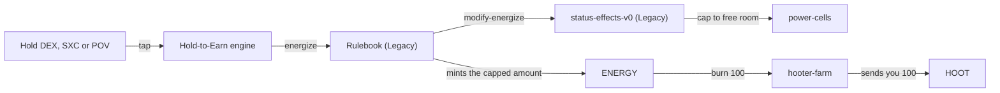

# Hold-to-Earn

Hold certain LP tokens in your wallet and you earn ENERGY. Nothing is staked or locked; you claim ("tap") whenever you like.

## Tokens that earn

The Invest app lists these engines in [`/api/v1/vaults`](https://invest.charisma.rocks/api/v1/vaults) as `type: "ENERGY"`. Each engine reads one token, fixed in its code.

| Token you hold | Pool | Engine (`SP2D5BGGJ956A635JG7CJQ59FTRFRB0893514EZPJ.…`) |
|---|---|---|
| DEX `SP2ZNGJ85ENDY6QRHQ5P2D4FXKGZWCKTB2T0Z55KS.dexterity-pool-v1` | CHA–DMG | `dexterity-hold-to-earn` |
| SXC `SP2ZNGJ85ENDY6QRHQ5P2D4FXKGZWCKTB2T0Z55KS.charismatic-flow` | STX–CHA | `charismatic-flow-hold-to-earn` |
| POV `SP2ZNGJ85ENDY6QRHQ5P2D4FXKGZWCKTB2T0Z55KS.perseverantia-omnia-vincit` | CHA–HOOT | `perseverantia-omnia-vincit-hold-to-earn` |

## Formula

`ENERGY = your average balance × Stacks blocks since your last tap × incentive score ÷ token supply`

- The average comes from 2 to 39 balance samples between taps (more for longer gaps).
- The score comes from `engine-coordinator`. All three tokens use the default, 100,000,000, at the time of writing (1 October 2026).
- At that score, holding 1% of a token's supply earns 1 ENERGY per Stacks block.
- The Invest dashboard estimates your rate from past taps; the contract math is what counts.

## Capacity

Max ENERGY = 100 + 10 per [Memobot](https://explorer.hiro.so/txid/SP2ZNGJ85ENDY6QRHQ5P2D4FXKGZWCKTB2T0Z55KS.memobots-guardians-of-the-gigaverse?chain=mainnet) you hold (`power-cells`, `get-max-capacity`). A tap mints only up to your free room and resets your clock, so **anything above capacity is lost**. Tap and spend often to keep room free.

## Harvest and spend

1. Open **Invest → [Hold-to-Earn](https://invest.charisma.rocks/energy)**.
2. Tap each engine (one transaction each).
3. Spend: each `hooter-farm` claim burns exactly 100 ENERGY and sends 100 HOOT while the farm has HOOT. The app's button uses `hooter-farm-x10`, which tries up to 10 claims in one transaction and skips any you can't afford.

## Boosts

| Boost | Applies to Hold-to-Earn? |
|---|---|
| Memobots | Yes: +10 capacity each |
| Energetic Welsh (Welsh NFTs) | No. It only boosts 7 legacy meme-engine contracts |
| Raven Wisdom | No. It cuts ENERGY burned by the Rulebook's `exhaust`, and DMG moved or burned through it, by 25% + 0.25% per Raven ID (up to 50%). `hooter-farm` burns ENERGY directly, so HOOT claims get no discount |
