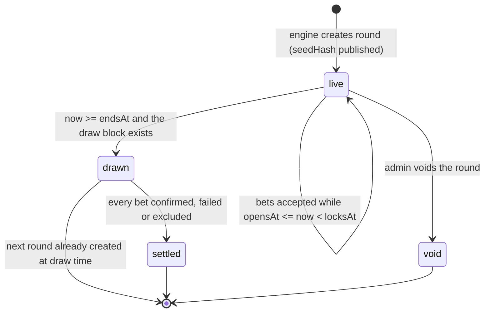
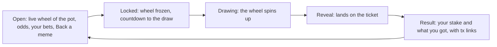

# Meme Roulette v2: design and implementation

Status: approved by Ross for implementation (2026-10-02). It replaces the round logic described in
`MULTISTAGE_SPIN.md`, `WINNER_SELECTION_SOLUTION.md` and `BALANCE_VALIDATION.md`, which are deleted with the old code.

## In one picture

```
Today:  many timers on many servers each try to run the spin  →  double winners, replays, lost bets
v2:     one round record, one engine that moves it forward, every screen just draws that record
```

| Goal | How v2 gets there |
|---|---|
| One winner per round, provably fair | A seed committed when the round opens, mixed with a Stacks block hash nobody knows in advance |
| Everyone sees the same spin | The wheel's slices, landing angle and timing all come from the round record and the server clock |
| No double payouts, no lost bets | Bets keyed by their signed UUID; each bet carries its own settlement status; a crash just resumes |
| Odds can't be faked | Only signed, funded bets count. The unauthenticated vote and tally endpoints are gone |
| You get what the pump gives you | No price protection on purpose (Ross): the group buy is meant to pump the winner, and traders racing it is part of the game. Payouts still only go to the bettor |
| Easy to play | Connect first, one transaction to get playable CHA, one sheet to back a meme, a personal result |
| Local dev can't touch production | The engine only runs where `ROULETTE_ENGINE=on` (production sets it) |

## What was wrong (audit summary, 2026-10-02)

| # | Problem | Where |
|---|---|---|
| 1 | Several winner picks per spin: overlapping 2 s stream ticks, every server instance and the cron all pick with `Math.random()`; the winner `kv.set` has no only-if-unset guard; each pick starts its own swap processor | `stream/route.ts`, `cron/process-queue`, `state.ts` |
| 2 | Anyone can add votes for any address (`POST /api/place-bet`) or overwrite the tally (`POST /api/token-bet`) | both routes |
| 3 | Re-posting one signed intent counts it again (no uuid de-duplication) | `multihop/queue` |
| 4 | Swaps run without price protection | `multihop/process`. Kept on purpose in v2: the pump is the point |
| 5 | Failed swaps are popped and lost; bets after the lock are accepted and roll into the next round's winner | `multihop/process`, `multihop/queue` |
| 6 | The reset needs a viewer; history has one round in total | `stream/route.ts` |
| 7 | Concurrent votes overwrite each other (one JSON blob, read-modify-write) | `state.ts` `recordUserVote` |
| 8 | `admin/winner` uses a fixed message, so a captured signature can set any winner forever; several admin and test routes have no auth at all | `admin/*`, `ath-test`, `leaderboard` POST |
| 9 | The client replays the result every 2 s, the four stage screens race the server, each device builds its own reveal | `page.tsx`, `SpinAnimationOverlay.tsx` |
| 10 | Local dev reads and writes production KV with the solver key, so a local tab at round end fires real swaps | `.env.local` + stream route |

## The round record

One JSON document per round. The engine is the only writer.

```ts
interface Round {
  id: string;                 // "round_<n>", numbered so leaderboard streaks can follow consecutive rounds
  status: 'live' | 'drawn' | 'settled' | 'void';
  opensAt: number;            // ms, server clock: bets accepted from here
  locksAt: number;            // = endsAt - lockMs: bets refused from here
  endsAt: number;             // the draw time
  seedHash: string;           // sha256(seed), public from the moment the round opens
  seed?: string;              // 32 random bytes hex; stored server-side, published only once drawn
  draw?: {
    block: { height: number; hash: string; time: number }; // first Stacks block with time >= endsAt
    ticket: string;           // bigint as string: H mod total
    total: string;            // total valid stake, micro-CHA
    slices: { tokenId: string; stake: string }[];          // frozen, sorted by tokenId
    winner: string | null;    // token contract id; null when nobody played
    drawnAt: number;          // ms, server clock; the reveal animation starts here
    turns: number;            // 6–9 whole turns before landing, from the same hash
  };
  settledAt?: number;
  version: number;            // bumped on every write; writes compare it
}
```

Bets live next to it, one hash field per signed UUID:

```ts
interface Bet {
  uuid: string;               // the signed intent's uuid: the bet's identity
  user: string;               // the signer (recovered, never trusted from the body)
  tokenId: string;            // the meme this bet backs
  amount: string;             // micro-CHA
  signature: string;
  router: string;             // which multihop router it was signed for
  placedAt: number;
  status: 'placed' | 'excluded' | 'sending' | 'sent' | 'confirmed' | 'failed';
  txid?: string;
  amountOut?: string;         // winning-token units received, read from the transaction result
  error?: string;
  attempts?: number;
  sentAt?: number;
}
```

### KV layout

| Key | Holds |
|---|---|
| `roulette:v2:config` | `{ roundMs, lockMs, intermissionMs }`; until it is saved, the v1 round and lock lengths apply |
| `roulette:v2:current` | the newest round id |
| `roulette:v2:round:<id>` | the `Round` document |
| `roulette:v2:round:<id>:bets` | hash: uuid → `Bet` |
| `roulette:v2:history` | sorted set of drawn round ids by `endsAt` |
| `roulette:v2:stats` | `{ athTotal, previousTotal }` |
| `roulette:v2:lock` | the engine lock (`SET NX PX`) |

Old `spin:*` keys and `meme-roulette-tx-queue` are left in place, unused (the queue was empty at cutover).

## Round lifecycle



What players see is derived from the record and the server clock, never stored:

| Shown | When |
|---|---|
| Open | `live` and `now < locksAt` |
| Locked | `live` and `locksAt <= now < endsAt` |
| Drawing | `live` and `now >= endsAt` (the engine is a moment away) |
| Reveal | the last round is `drawn` and `now < drawnAt + 12 s` |
| Result | after the reveal, until the next round opens (`intermissionMs`, default 60 s) |

## The engine

`advanceRound(budgetMs)` in `src/lib/roulette/engine.ts` is the only code that writes round state. It is safe to call
from anywhere, any number of times, at once:

1. Take `roulette:v2:lock` with `SET NX PX` (a random token, released with a compare-and-delete). No lock, no work.
2. Load the current round. If none exists, create the first one.
3. If it is `live` and `now >= endsAt`, draw it (below). The draw also creates the next round, with
   `opensAt = drawnAt + intermissionMs` and `endsAt = opensAt + roundMs`.
4. Settle every `drawn` round still in history with unsettled bets, within `budgetMs`.
5. Release the lock.

Callers:
- **Vercel cron** `/api/cron/advance` every minute, `budgetMs` 50 s. Authorized by `CRON_SECRET`
  (Vercel sends `Authorization: Bearer <CRON_SECRET>`).
- **The round GET** runs `after(() => advanceRound(8000))` when the round it is serving is overdue, so the draw happens
  within a second or two of `endsAt` while anyone is watching, and within a minute when nobody is.

Both only run when `process.env.ROULETTE_ENGINE === 'on'`. Production sets it; local dev doesn't, so a local server
is read-only even if it points at production KV.

### The draw

1. **Freeze.** Read every bet. For each user, check the on-chain subnet CHA balance (`getUserTokenBalance`). Keep the
   user's bets oldest first while the running total fits the balance; mark the rest `excluded`.
2. **The block.** Fetch recent Stacks blocks from Hiro (`/extended/v2/blocks`, with `x-api-key`) and take the earliest
   one whose `block_time * 1000 >= endsAt`. If it hasn't been mined yet, return and try again on the next call.
3. **The ticket.** `H = sha256(seed ‖ blockHash)` as a 256-bit integer; `ticket = H mod total`.
4. **The winner.** Walk the slices (valid stake per token, sorted by tokenId) until the running sum passes `ticket`.
5. **Write once.** Save the round with `status: 'drawn'`, the seed, the block, the slices, the ticket and the winner,
   only if `version` is unchanged. Create the next round. Write the leaderboard round summary and add the round to history.

No valid stake means `winner: null`, `status: 'settled'`, and the next round opens.

**Why it's fair:** the server commits to the seed before any bet, and the block hash doesn't exist until after betting
closes, so neither the server nor a player can steer the result. Anyone can recheck a round from its public record:

```ts
const H = BigInt('0x' + sha256(hexToBytes(seed + blockHash.replace(/^0x/, ''))));
const ticket = H % total;   // then walk the slices
```

### Settlement

Each call first checks the swaps in flight, then broadcasts the rest of a drawn round's `placed` bets, oldest first,
while the time budget lasts:

1. Mark it `sending` (with `attempts + 1`) and save before broadcasting.
2. Quote CHA (subnet) → winner fresh with `dexterity-sdk`.
3. `buildXSwapTransaction(quote, { amountIn, signature, uuid, recipient: user }, routerConfigFor(router))` with
   post-conditions in allow mode and none set. There is no price protection by design: every swap after the first
   lands on a price the earlier ones pumped, and traders who race the pump are part of the fun.
4. Broadcast with the solver's next nonce. Nonce conflicts refetch the nonce and retry the same bet.
5. Mark it `sent` with the txid.

`sent` bets are checked on Hiro: `success` → `confirmed` with `amountOut` read from the router's result (the last `dy`).
An abort rolls the swap back, so its uuid is unspent and the bet goes again on a later pass, up to 3 attempts, then it is
`failed`. Before any retry, `blaze-v1` `check(uuid)` is read: a spent uuid means an earlier attempt landed (a crash
mid-broadcast, a mempool we gave up on), so it is marked confirmed instead of sent again.

When every bet is final, the round becomes `settled`, real earnings go to the leaderboard
(`updateUserStatsWithRealEarnings`), and `roulette:v2:stats` updates the all-time high and the previous total.

Settlement runs after the winner is public, so a player could still withdraw before their swap lands. Their swap then
fails for balance and only they miss out; the odds were already fixed by then.

## API

| Route | Who | Does |
|---|---|---|
| `GET /api/round` | anyone | `{ serverNow, round, last, recentBets }`, public fields only (no signatures, no seed before the draw). `?user=` adds that user's bets. `Cache-Control: s-maxage=1, stale-while-revalidate=2` |
| `GET /api/rounds/<id>` | anyone | A drawn round with its seed, block, slices and per-bet results: everything needed to verify it |
| `POST /api/bets` | a signed intent | Recovers the signer for a known router (`findSignedRouter`); checks the token is listed and the round is open (`opensAt <= now < locksAt`, server clock); checks the user's subnet balance covers all their bets this round; stores with `HSETNX` (a repeat uuid answers 200 for the same signature, 409 otherwise); updates leaderboard stats |
| `GET /api/cron/advance` | Vercel cron | `advanceRound(50_000)` |
| `GET /api/admin/round` and `POST /api/admin/round` | Ross (timestamped signature) | Read config and full state; set the round, lock and intermission lengths; reschedule the live round's `endsAt`; void the live round |

Removed: `place-bet`, `token-bet`, `stream`, `multihop/queue`, `multihop/process`, `cron/process-queue`, `ath-test`,
`test/earnings`, `admin/winner`, `admin/spin-time`, `admin/reset`, `admin/token-bet`, `admin/validate-balances`,
`admin/round-duration`, `admin/lock-duration`, `admin/user-votes`, `admin/status`, `admin/cron-status`, and the
unauthenticated POST actions on `leaderboard` and `leaderboard/init`.

Every remaining admin route (`admin/round`, `admin/achievements`, `admin/referrals`, `admin/leaderboard` POST,
`leaderboard/init`, a manual `cron/process-achievements` run) uses `verifySignedRequestWithTimestamp` (blaze-sdk) with
the message `charisma-roulette-admin`: the signature covers a timestamp and expires after five minutes. Both crons check
`CRON_SECRET`.

## The client

### One hook

`useRound(user?)` polls `GET /api/round` every 2 s (every 500 ms within 15 s of a boundary), and pauses while the tab is
hidden. It keeps `offset = serverNow - Date.now()` (smoothed) and exposes `now()` on the server clock, so countdowns, the
lock and the reveal are the same on every device whatever its clock says. New entries in `recentBets` become toasts.
No SSE, no reconnect logic, nothing to replay.

### Screens



- **Open.** The wheel shows the pot live: one slice per backed meme, sized by its share, labelled with its odds. Your
  slices are outlined. Below: the countdown, the pot, recent bets, and one call to action, **Back a meme**.
- **Back a meme.** One sheet: connect if needed; if the subnet CHA balance is short, **Get CHA to play** swaps STX
  straight into subnet CHA in one transaction (the router's sublink hop, `0x05`); then pick a meme and an amount and sign.
- **Locked.** The wheel stops updating and dims; the countdown runs to the draw.
- **Reveal.** Everyone's wheel runs the same 9 s animation from `drawnAt`; someone arriving late joins mid-spin, and a
  reload resumes where it was. It lands on the ticket's exact angle, so what you see is the proof.
- **Result.** "You backed WELSH with 25 CHA → 1,240 WELSH" with a transaction link, or "Your 25 CHA bought 1,240 WELSH"
  when another meme won, since everyone receives the winner. Then "Next round in 0:42".

One verb everywhere: you **back** a meme; everyone's CHA is **the pot**.

### The wheel

Deterministic, so it can't glitch apart between devices:

- Slices: the frozen `draw.slices` (live tally before the draw), sorted by tokenId, angle proportional to stake.
- The landing angle is the ticket's position: `θ_ticket = 2π · ticket / total`. The wheel turns so `θ_ticket` stops
  under the pointer after `6 + f` full turns, where `f` comes from the seed (so it isn't always the same number of turns).
- The angle at time `t` is `θ(t) = θ_end · easeOutQuint(clamp((t - drawnAt) / 9000, 0, 1))`, a pure function of
  server time. No physics, no randomness on the device.

It's drawn with **react-three-fiber** (`@react-three/fiber` 9.2 on `three` 0.178, both already in the lockfile through
`react-spring`): a lacquered 3D wheel with token logos on the slices, a pointer, a soft light
rig, and a burst of confetti on landing. The 3D scene is loaded lazily (`next/dynamic`, `ssr: false`), caps its frame
rate, pauses when the tab is hidden, and falls back to a 2D SVG wheel driven by the same `θ(t)` when WebGL is missing,
the context is lost, or the user prefers reduced motion. Both wheels read colours from the realm tokens, so they work
by day and by night.

## Safety

| Guard | Where |
|---|---|
| Engine only where `ROULETTE_ENGINE=on` | `engine.ts`, both callers |
| One engine at a time | `roulette:v2:lock`, `SET NX PX` with a compare-and-delete release |
| Writes compare `version` | every round write |
| Bets idempotent by uuid | `HSETNX` |
| Bets only while open, by server clock | `POST /api/bets` |
| Signer recovered, never taken from the body | `findSignedRouter` |
| Payout locked to the signer | bets are signed for `x-multihop-v1` |
| Cron and admin authenticated | `CRON_SECRET`; timestamped signatures |

**Recommended (Ross):** give the game its own solver wallet. Today Meme Roulette and Swap's executor broadcast from the
same account (`SP3619…ZQDN`), so their nonces can collide. v2 refetches the nonce and retries on a conflict, but a
dedicated `PRIVATE_KEY` with a little STX for fees removes the overlap entirely. Local `.env.local` should drop
`PRIVATE_KEY` and point at a separate KV.

## Cutover

1. Deploy with `ROULETTE_ENGINE=on` and `CRON_SECRET` set in Vercel (production only).
2. The first `advanceRound` finds no `roulette:v2:current` and creates the first round. It keeps the live schedule: if
   the old `spin:scheduled_at` is in the future, that becomes the first round's `endsAt`.
3. The old queue was empty and no bets were placed in the old round, so nothing migrates.

## Tests

- `draw.test.ts`: the ticket and winner are deterministic for a given seed, block hash and slices; every micro-CHA of
  stake maps to exactly one token; a single bettor always wins; zero stake gives no winner.
- `engine.test.ts` (in-memory KV): two concurrent `advanceRound` calls draw once; a repeat call after the draw is a
  no-op; `sending` bets resume; excluded bets never broadcast; the next round opens at `drawnAt + intermission`.
- `wheel.test.ts`: `θ(t)` is monotonic, starts at 0, and ends exactly on the ticket.
- `bets.test.ts`: a repeat uuid is idempotent; bets after `locksAt` are refused; bad signatures are refused.

## Defaults Ross can change

| Setting | Default |
|---|---|
| Round length | kept from the current config |
| Lock before the draw | kept from the current config |
| Time between rounds | 60 s |
| Manual "set winner" | removed (it can't coexist with a provably fair draw) |
