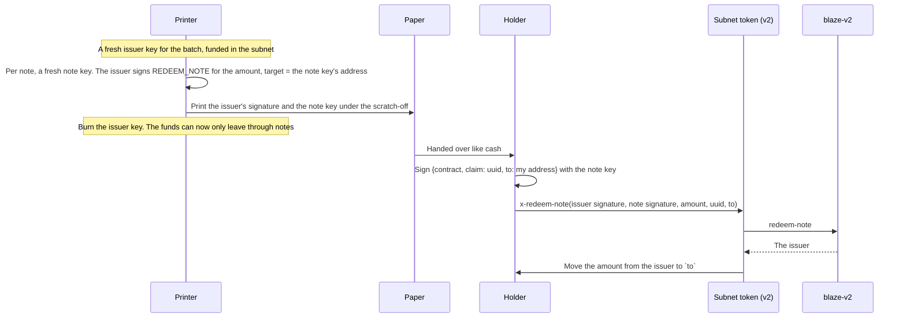

# Blaze v2

**Status:** deployed on mainnet (2026-10-02) by `SP2ZNGJ85ENDY6QRHQ5P2D4FXKGZWCKTB2T0Z55KS`, alongside v1, which keeps
working. Every new subnet uses v2 from now on. Existing balances move over through the migration below, at each
player's pace.

| Contract | What it is |
|---|---|
| `blaze-v2` | The verifier: SIP-018 intents, per-signer replay protection, bearer notes, cancel for good |
| `x-multihop-v2` | The swap router for subnets on **either** version; it always pays the signer |
| `charisma-token-subnet-v2` | CHA on Blaze v2 |
| `charisma-sublink-v2` | The vault that moves CHA in and out of the v2 subnet (`0x05` / `0x06`) |
| `welsh-token-subnet-v2`, `welsh-sublink-v2` | WELSH on Blaze v2, and its sublink |
| `sbtc-token-subnet-v2`, `sbtc-sublink-v2` | sBTC on Blaze v2, and its sublink |

Sources: `contracts/blaze-v2.clar`, `contracts/routers/x-multihop-v2.clar`, `contracts/subnets/`. The Launchpad's
`subnet-wrapper-v2.template.clar` is what new subnets are made from. `tests/blaze-v2.test.ts` runs all of it end to end
in simnet against subnets and sublinks rendered from those templates.

## What changed from v1

| | blaze-v1 | blaze-v2 |
|---|---|---|
| Intent hash | `{contract, intent, opcode, amount, target, uuid}` | The same tuple |
| Domain | `BLAZE_PROTOCOL` / `v1.0` | `BLAZE_PROTOCOL` / `v2.0`, so a v1 signature can't be replayed on v2 |
| Replay protection | One global set of uuids, written before the signature is checked: anyone could burn your uuid with a junk signature | Keyed by **(signer, uuid)**, written after the signature checks out: a junk signature only spends a random principal's uuid |
| Cancelling for good | Spend your uuid through `execute` (which anyone could also do to you) | `revoke(uuid)`: a direct call from your wallet spends your own uuid. A contract can't do it for you |
| Bearer notes | The note *is* a signature, and the payout address isn't signed: a mempool watcher can copy it and pay itself | The note holds its own **note key**, and redeeming signs "pay **this** address" with it |
| `check` | `check(uuid)` | `check(signer, uuid)` |

For apps the only signing change is the domain version. The tuple a wallet signs is the same.

## Bearer notes: paper cash

The goal: print a note's secret under a scratch-off, hand the paper to anyone, and whoever holds it redeems to any
address they choose.

`redeem-note` recovers the note key's address from the claim, then the issuer from an ordinary intent whose `target` is
that address. Change `to`, and the claim recovers a different note address, so the issuer recovers as a stranger with no
balance and the transfer fails. The note key never goes on-chain. Whoever prints a note sees its key (that's the
printer's job); the burned issuer key is the escrow.

## Migration: v1 keeps working, players drift to v2

Nobody can move a player's funds without their signature, so migration can't be fully automatic. It can be effortless:

1. **All new subnets are v2.** The Launchpad's subnet template now calls `blaze-v2`.
2. **One balance.** Apps read both CHA subnets and show the total.
3. **Old first, new in.** Spending signs from the v1 balance until it's empty; deposits and anything paid into a subnet
   land in v2. The v1 balance drains through normal use.
4. **One-tap upgrade.** "Move to v2" is an ordinary swap through `x-multihop-v2`: CHA v1 subnet → `sub-link-vault-v7`
   (`0x06`, out of v1) → `charisma-sublink-v2` (`0x05`, into v2) → paid to the signer as v2 subnet CHA. One free
   signature; the solver pays the fee. It's covered by the "upgrades a v1 balance to v2" test.
5. **v1 never switches off.** The contracts are immutable. Apps keep reading and spending v1 for as long as anyone holds a
   balance there.

`x-multihop-v2` accepts a signature that recovers to `out.to` under either verifier; the subnet's own `x-transfer` then
checks it again under that subnet's version, so a v2 signature can never move a v1 balance or the other way round
(also tested).

## What's next

- `blaze-sdk`: sign for the v2 domain, recover v2 signers, know which subnets are v2, and default swaps to
  `x-multihop-v2`.
- Swap, Meme Roulette and the wallet: the combined balance, old-first spending, v2 deposits and the upgrade button.
- WELSH and sBTC are on v2 too (2026-10-02). The other subnets stay on v1; their owners can redeploy from Launchpad.
- An audit before balances grow large on v2.
